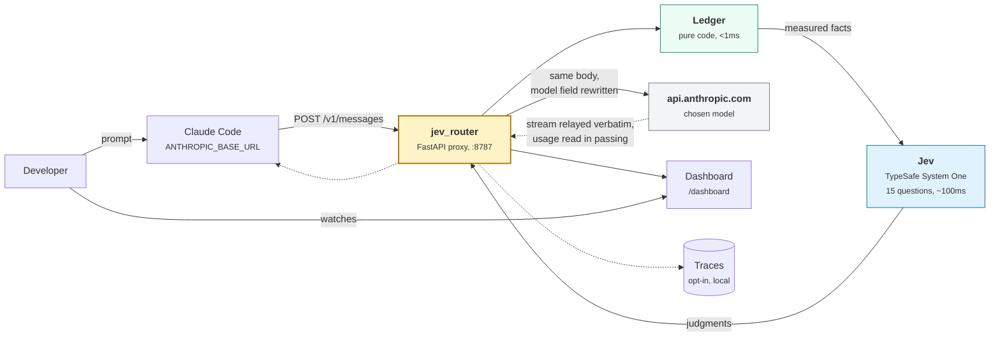

# claude-code-jev-smart-router

Per-step model routing for Claude Code, judged by Jev.

A proxy sits on `ANTHROPIC_BASE_URL`. For every turn it rebuilds a factual
ledger of the session from the request body, asks Jev 15 atomic questions about
the agent's **next step**, picks a model, and forwards the request upstream with
only the `model` field changed.

> **Proof of concept.** It works and it is honest about what it does not know.
> You need your own TypeSafe key. Every threshold in the policy is a prior, not
> a tuned value. Measure your own traffic before you trust it with real spend.

## The gap it fills

Claude Code already switches models three ways. `opusplan` switches at the plan
boundary. `fallbackModel` switches when a request fails. Automatic fallback
switches on a safety classifier. None of them look at how hard the turn is.

## Why this is an AI-SDLC accelerator and not a length heuristic

Routing on prompt size is the obvious thing and it is wrong. A one-line request
to rotate a credential is harder than a thousand-line file to reformat.

So the unit being routed is the next step of a work unit, placed in a software
lifecycle: **clarify, explore, plan, implement, debug, verify, review,
integrate**. Where the agent is in that lifecycle, and what a mistake there
would cost, is what picks the model. Searching is cheap cognition. Deciding an
approach is not. A wrong edit that the test suite catches in ten seconds is
cheap. The same wrong edit in an auth path with nothing checking it is not.

That is the whole idea, and it collapses to one line:

**tier = cognitive demand &#215; cost of an undetected error**


## How it fits together



The credential arrives and leaves untouched. `cache_control` markers, the
`system` block array and the `anthropic-beta` header all pass through verbatim.
The only thing that changes is which model serves the turn.

## How it decides, in three layers

Keeping these separate is the point. Conflating them is how a router like this
loses money.

1. **What the work wants.** Nine SDLC phases set a base tier, then cognitive
   demand and blast radius move it. `oracle_in_loop`, `risk_surface` and
   `irreversible` are first-class axes, because a cheap model is safe when a
   check in the loop catches its mistakes and dangerous when nothing does.
   Safety picks set a **floor** that no downgrade may cross.
   See [docs/ONTOLOGY.md](docs/ONTOLOGY.md).
2. **What the prompt cache allows.** Each model keeps its own cache, so
   switching mid-conversation makes the new model re-read the entire prefix at
   full input price. On a long session that prefix is most of your tokens, so a
   naive per-turn router can cost several times what pinning Opus costs. Every
   switch is therefore priced, not counted. A warm-cache downgrade has to pay
   for itself within three turns. Upgrades are never for sale.
   See [docs/ARCHITECTURE.md](docs/ARCHITECTURE.md).
3. **What the tool stream says.** Tool calls are the fact source. Tool names map
   to 13 kinds, bash commands sort into 9 consequence classes most-consequential
   first, and tool results yield pass/fail, failure fingerprints and
   edits-since-last-check. The router reads the tool stream. It never prunes,
   reorders or blocks tools.

## Quickstart

```bash
pip install -r requirements.txt

export TYPESAFE_API_KEY=...        # console.typesafe.ai/settings/keys
uvicorn jev_router:app --port 8787
```

Then point Claude Code at it. On a Claude subscription (Pro, Max, Team) set the
base URL and nothing else:

```bash
export ANTHROPIC_BASE_URL=http://127.0.0.1:8787
claude
```

Do **not** set `ANTHROPIC_API_KEY` or `ANTHROPIC_AUTH_TOKEN` on that path, and
do not run `/logout`. `ANTHROPIC_BASE_URL` on its own does not replace the
subscription: traffic routes through the proxy while your saved claude.ai login
stays the active credential. Setting a gateway credential is what replaces it,
and then the traffic bills per token to whoever owns that credential.

With an API key instead, export `ANTHROPIC_API_KEY` as usual. Both paths, the
`/model` override trick and all 28 environment variables are in
[docs/DEVELOPER.md](docs/DEVELOPER.md).

No key? The router still runs. It forwards every request untouched and routes
nothing.

## Dashboard

`GET /dashboard` is a single self-contained page, no build step, polling
`/router/metrics` every 2.5s. It shows a 30 minute rail of decisions (filled
means the model moved, hollow means it held, height is the price tier), spend
against a pin-the-top-tier baseline, the cache hit gauge, traffic by model,
classifier p50 and p95, and a decision feed with the reasoning for each pick.
There is a live toggle to turn routing off without restarting.

<!-- Screenshot to come: docs/img/dashboard.png -->

The savings number on that page is an **upper bound**. It prices a weaker
model's extra turns at the top tier. The honest number comes from traces.

## Limits, stated plainly

- **It observes, it does not gate.** A `git push`, a `terraform apply`, an MCP
  write: all of them appear in the ledger only after they ran. The
  `irreversible` question predicts the next step, it cannot stop the last one.
  Gating belongs in a `PreToolUse` hook or `permissions.deny`.
- **One process.** State is a tier integer and a few counters per session, in
  memory. Run uvicorn with its default single worker. `--workers N` gives
  same-session requests different sticky tiers and hysteresis quietly stops
  working.
- **No images to Jev.** Turns carrying screenshots are judged on their text and
  ledger alone.
- **Tool names drift** between Claude Code releases. Everything name-dependent
  is isolated in tables at the top of `jev_ontology.py` so it can be corrected
  without touching logic. Re-check after upgrading.
- **A tier is a price per token, not a cost per task.** A cheaper model that
  needs more turns is not cheaper. The router prices each side with its own
  observed output volume, and if the "cheaper" model talks enough more it stays
  put.
- Anthropic does not endorse, maintain or audit third-party gateways, and does
  not support routing Claude Code to non-Claude models through one.

## Docs

| | |
| --- | --- |
| [docs/ARCHITECTURE.md](docs/ARCHITECTURE.md) | Context and container views, request lifecycle, the decision tree, the cache economics |
| [docs/ONTOLOGY.md](docs/ONTOLOGY.md) | The ontology, visualized. Nine phases, 15 questions, the scoring walk-through |
| [docs/DEVELOPER.md](docs/DEVELOPER.md) | Install, wiring, all 28 knobs, tracing and calibration, extending, troubleshooting |

`ROUTING NOTES` at the foot of `jev_router.py` is the authoritative commentary
on why the cache interaction decides whether this saves money. The docs point at
it rather than copying it.

## Before you trust it with real spend

Run a week pinned to Opus, then a week routed, and compare `/cost`. Prompt
caching means the naive version of this loses money, and the only way to know
which side you land on is to measure your own traffic. On a subscription you are
conserving usage limit rather than reducing a bill, so judge it on how often you
hit limits instead.

## License

MIT. See [LICENSE](LICENSE).
