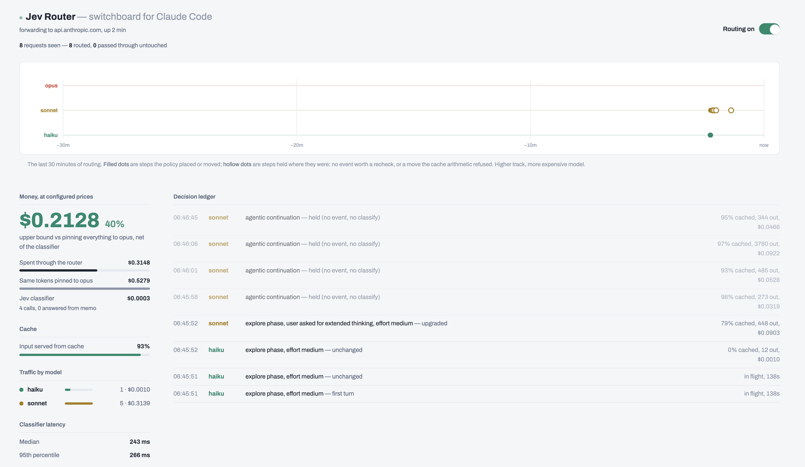
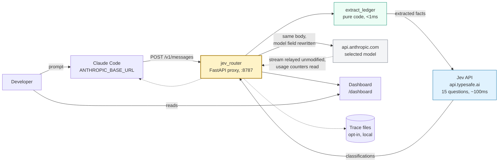

# claude-code-jev-smart-router

An HTTP proxy for Claude Code that selects the Claude model per request, to
reduce cost and latency.

## Motivation

Claude Code serves a session from one selected model, changing it only at fixed
points (see [Routing logic](#routing-logic)) rather than according to what each
request requires. That model handles every request in the agentic loop, including
the ones that do not need it: file reads, greps, test runs, commit messages.

Routing those requests to a lower tier has three effects:

| Effect | Mechanism |
| --- | --- |
| Cost | Lower tiers have lower per-token prices, for input and output both. |
| Latency | Smaller models return sooner. Separately, lower effort reduces the number of agentic turns a step takes. |
| Usage limits | On a Pro, Max or Team subscription there is no per-token bill. Routing consumes less of the plan's allowance instead. |

Classification adds one API call per routed request: a fraction of a cent, and
well under a second of added latency. That is small enough to sit in the request
path, which is what makes per-request routing possible at all. See
[The classifier](#the-classifier).

### Prompt cache constraint

Prompt caching limits how often switching is worthwhile. Each model has a
separate cache, so a mid-conversation switch causes the new model to re-read the
conversation prefix at full input price. In a long session that prefix accounts
for most of the token volume, so switching on every request can cost more than
using a single model throughout.

The proxy prices each switch against the cache rebuild it would cause and applies
it only when it pays back within a few turns. See
[Cache management](#cache-management).

Savings are unmeasured. Whether routing reduces cost on a given workload depends
on that workload. See [Measuring cost impact](#measuring-cost-impact).

## How it works

It listens on `ANTHROPIC_BASE_URL`, intercepts `POST /v1/messages`, extracts
facts about the session from the request body, sends those facts to the Jev API
for classification, maps the response to a model, and forwards the request
upstream to `api.anthropic.com` with only the `model` field rewritten. Response
streams are relayed unmodified.

Two modules:

| File | Contents | Dependencies |
| --- | --- | --- |
| `jev_ontology.py` | Fact extraction, the question set, the tier policy | stdlib only |
| `jev_router.py` | The proxy, cache cost arithmetic, telemetry, dashboard | fastapi, httpx |

## The classifier

Per-request routing needs a classification step inside the request path. A
general-purpose model prompted to classify would add seconds and a meaningful
token bill to every request, which is most of what the routing is trying to save.

Jev is a classification model rather than a generative one, served by TypeSafe at
`api.typesafe.ai/v1/systemone`. Three properties are what make in-path use
practical:

**One round trip for the whole question set.** The extracted session facts and
every question go in a single POST, and every answer comes back together. A user
turn sends 15 questions; a mid-run recheck sends the 12 that do not depend on a
new user message:

```http
POST https://api.typesafe.ai/v1/systemone
Authorization: Bearer $TYPESAFE_API_KEY
Content-Type: application/json

{"model": "jev-latest",
 "state": "<extracted session facts>",
 "questions": { ... }}
```

**Typed answers, not prose to parse.** Each question declares its type and the
response supplies that type directly. `choice` returns a label from the
definition set supplied with the question, `score` returns an ordinal, and `noul`
returns a likelihood between 0 and 1:

```json
{"answers": {
   "phase":            {"choice": "debug", "confidence": 0.82},
   "next_step_demand": {"score": 2,        "confidence": 0.71},
   "risk_surface":     {"noul": 0.88,      "confidence": 0.90}
 },
 "usage": {"input_tokens": 501}}
```

(Abridged. Field names are as the router reads them; the values are
illustrative.)

**Per-answer confidence, used rather than displayed.** Every answer carries its
own confidence. The router acts on it: when confidence in `phase` falls below
`ROUTER_MIN_CONFIDENCE`, that answer is discarded and the deterministic
tool-derived phase hint is used instead. The demand adjustments are gated the
same way. An uncertain classifier degrades to the facts rather than guessing.

This is also why the ontology asks many small questions instead of one "which
model should serve this request". The model is calibrated per individual
judgment, so decomposing the decision keeps each answer meaningful, and the
weighing happens afterwards in `pick_tier_v2`, in code that can be read and
changed.

Failure is not fatal. The call has a timeout, and any error, timeout or
non-200 response returns no answers, at which point the session keeps its current
tier or the request forwards as received.

## Measured runs

Two consecutive tasks, Claude Code configured with Opus in both. Opus served
neither.

### Run 1: write the app

Prompt: `make a to do app in single html`. Five requests, 31 seconds wall clock.

| # | Model | Decision |
| --- | --- | --- |
| 1 | haiku | utility call (`max_tokens=1`), pinned, session state untouched |
| 2 | sonnet | plan phase, canonical build, capped (0.94), first turn |
| 3 | sonnet | plan phase, canonical build, capped (0.93), unchanged |
| 4 | haiku | utility call (`max_tokens=64`), pinned, session state untouched |
| 5 | sonnet | agentic continuation, held (no event, no classify) |

Three documented behaviours are visible:

- **The canonical cap.** A to-do app in one HTML file is a canonical artifact, so
  the tier was capped one rung below the top. That is why Opus never ran, and the
  cap plus its confidence appear in the reason string.
- **The utility pin.** Two of the five were sidecar calls filtered by
  `max_tokens` and kept out of session state.
- **The continuation hold.** One tool-result turn was held without a classifier
  call because no recheck trigger fired.

Two of five requests reached the classifier.

### Run 2: document the app

Prompt: `create documentation for @todo.html`. Eight requests, 57 seconds wall
clock.

| # | Model | Decision |
| --- | --- | --- |
| 1 | haiku | explore phase, effort medium, first turn |
| 2 | haiku | explore phase, effort medium, unchanged |
| 3 | haiku | explore phase, effort medium, unchanged |
| 4 | sonnet | explore phase, user asked for extended thinking, effort medium, **upgraded** |
| 5 | sonnet | agentic continuation, held (no event, no classify) |
| 6 | sonnet | agentic continuation, held (no event, no classify) |
| 7 | sonnet | agentic continuation, held (no event, no classify) |
| 8 | sonnet | agentic continuation, held (no event, no classify) |



This run exercises different rules than the first:

- **Explore starts cheap.** The `explore` phase has the lowest default tier, so
  reading the file and looking around the directory ran on Haiku.
- **An upgrade fired mid-run.** The request carried a raised thinking budget,
  which floors the tier at the middle rung (`jev_ontology.py:814`, the source of
  that reason string). Upgrades are applied immediately without pricing the cache
  rebuild, which is the documented asymmetry: no token arithmetic justifies
  under-serving a request that asked for more thinking.
- **Four consecutive holds.** Once writing began, four tool-result turns ran at
  93% to 98% cached with no classifier call between them. The continuation hold
  and the warm cache are both doing their job here.
- **Effort steering was on**, visible as `effort medium` in the reason strings.
  That lowers effort on the current model rather than switching models, so the
  cache survives.

Four of eight requests reached the classifier.

### Side by side

| | Run 1 | Run 2 | Both |
| --- | --- | --- | --- |
| Wall clock | 31 s | 57 s | 88 s |
| Requests | 5 | 8 | 13 |
| Requests classified | 2 | 4 | 6 |
| Input served from cache | 40% | 93% | |
| Spent through the router | $0.4299 | $0.3148 | **$0.7448** |
| Same tokens pinned to Opus | $0.8533 | $0.5279 | **$1.3812** |
| Difference | $0.4234 (49.6%) | $0.2131 (40.4%) | **$0.6365 (46.1%)** |
| Classifier spend | $0.0001 | $0.0003 | $0.0004 |
| Classifier latency, median | 294 ms | 243 ms | |

Figures recomputed from the router's own trace records rather than read off the
dashboard, which rounds. Opus was configured for both runs and served neither.
Classification cost $0.0004 to route $0.7448 of work.

### How to read these

The percentages are upper bounds, which is how the dashboard labels them. They
price the same token counts at Opus rates, and a model that needed more turns
would not have produced the same token counts.

The two runs differ, and the sample is far too small to explain why. Run 2 sent a
larger share of its completed requests to the middle tier, which narrows the gap
to an all-Opus baseline. That is arithmetic, not a finding.

Two tasks in two sessions is not a benchmark. It is a demonstration that the
machinery runs, that the documented rules fire, and that classification costs
roughly a thousandth of what the work costs.

## Status

Proof of concept. Specifically:

- Requires a TypeSafe API key. Without one, every request forwards unrouted.
- The thresholds in the tier policy are unfitted defaults, not measured values.
- Savings are not benchmarked. Two measured runs are in
  [Measured runs](#measured-runs). On other workloads prompt caching can make
  per-request routing more expensive than a single pinned model. Measure before
  relying on it.
- The default prices in `ROUTER_PRICES` are list prices recorded at the time of
  writing. Verify them before trusting the breakeven arithmetic.

## Routing logic

Claude Code already changes models in three situations: `opusplan` at the plan
boundary, `fallbackModel` on request failure, and automatic fallback on a safety
classifier. None of them consider task difficulty.

Routing on prompt length does not work either. A one-line request to rotate a
credential is harder and riskier than a thousand-line file to reformat.

This proxy classifies each request along two dimensions:

1. **Task phase.** One of nine software lifecycle phases: `clarify`, `explore`,
   `plan`, `implement`, `debug`, `verify`, `review`, `integrate`,
   `housekeeping`. Each phase has a default tier.
2. **Cost of an undetected error.** Whether a check the agent is already running
   would catch a mistake (`oracle_in_loop`), whether the work touches sensitive
   code such as authentication or migrations (`risk_surface`), and whether the
   next step acts outside the working tree (`irreversible`).

The source states the intent as `tier = cognitive demand x cost of an undetected
error` (`jev_ontology.py:28`). In practice it is a sequence of conditionals in
`pick_tier_v2`, documented in [docs/ONTOLOGY.md](docs/ONTOLOGY.md).

Resulting tiers for `phase = implement`:


Rows 3 and 4 set a floor. The cache cost check described below cannot select a
tier below a floor.

## Cache management

Each model maintains a separate prompt cache. Switching models mid-conversation
causes the new model to re-read the conversation prefix at full input price. On
long sessions that prefix is most of the token volume, so unconditional
per-request switching can cost more than pinning a single model.

The proxy therefore prices each switch before making it. `switch_delta()`
returns a per-turn saving and a one-time cost:

```
one_time  = prefix_tokens * ROUTER_CACHE_WRITE_MULT * in_price(target) / 1e6
per_turn  = current_turn_cost - target_turn_cost
```

Three cases:

| Cache state | Behavior |
| --- | --- |
| Cold (no request within `ROUTER_CACHE_TTL_SAFE`, default 240s) | Switch. Nothing to lose. |
| Warm, downgrade requested | Switch only if `per_turn * ROUTER_SWITCH_HORIZON > one_time` |
| Warm, upgrade requested | Switch immediately, without pricing |

Input token prices are read from the relayed response stream
(`input_tokens`, `cache_read_input_tokens`, `cache_creation_input_tokens`), not
estimated. Prices per model come from `ROUTER_PRICES`.

Note that a tier is a price per token, not a cost per task. A cheaper model that
emits more tokens or takes more turns can cost more per completed task, so
`switch_delta` prices each side using that model's observed output volume. If the
cheaper model's measured output rate is high enough, the saving is negative and
no switch occurs.

## Fact extraction

Facts are computed from the request body in code, not asked of the classifier.
`extract_ledger(body)` is a pure function, recomputed each request rather than
cached, so it survives restarts.

| Table | Purpose |
| --- | --- |
| `TOOL_KINDS` | 29 tool names mapped to 11 kinds (`read`, `search`, `edit`, `bash`, `subagent`, `todo`, `skill`, `plan`, `ask`, `web`, `meta`) |
| `BASH_CLASSES` | 8 bash command classes, checked in order, most consequential match wins |
| `FAIL_TEXT` / `PASS_TEXT` | Whether a tool result indicates a failed check |
| `RISK_SURFACE` | Regex for sensitive paths and identifiers |
| `ROLE_SNIFF` | Subagent role inferred from the `system` field |

Tool definitions are forwarded unchanged. The proxy does not filter, reorder or
block tools.

## Architecture



Passed through unmodified: the client credential, `cache_control` markers, the
`system` block array and its ordering, `anthropic-beta`, `anthropic-version`, and
the `?beta=true` query parameter. See
[docs/ARCHITECTURE.md](docs/ARCHITECTURE.md) for the full compliance list and the
known gaps.

## Installation

```bash
pip install -r requirements.txt

export TYPESAFE_API_KEY=...        # console.typesafe.ai/settings/keys
uvicorn jev_router:app --port 8787
```

Run a single worker. Session state is in-process, so `--workers N` routes
same-session requests to processes with different state.

Bind to loopback. The `/router/*` control endpoints have no authentication.

## Connecting Claude Code

### Subscription (Pro, Max, Team)

```bash
export ANTHROPIC_BASE_URL=http://127.0.0.1:8787
claude
```

Do not set `ANTHROPIC_API_KEY` or `ANTHROPIC_AUTH_TOKEN` on this path, and do not
run `/logout`. Setting `ANTHROPIC_BASE_URL` alone does not replace the
subscription: requests route through the proxy while the saved claude.ai login
remains the active credential. Setting a gateway credential replaces the
subscription, and traffic then bills per token to the owner of that credential.

On a subscription, routing conserves usage limit rather than reducing a bill.
Claude Code also stops validating plan requirements behind a gateway, so
`ROUTER_TIERS` must list only models the plan serves.

### API key

```bash
export ANTHROPIC_API_KEY=sk-ant-...   # used only if the client sends no credential
export ANTHROPIC_BASE_URL=http://127.0.0.1:8787
claude
```

To persist, add to `~/.claude/settings.json`:

```json
{
  "env": {
    "ANTHROPIC_BASE_URL": "http://127.0.0.1:8787"
  }
}
```

Configuration reference for all 28 environment variables, and how to keep
`/model` working as a manual override, is in
[docs/DEVELOPER.md](docs/DEVELOPER.md).

## Dashboard

`GET /dashboard` serves a single HTML page with no build step, polling
`/router/metrics` every 2.5 seconds. It displays:

- Decisions over the last 30 minutes. Filled marks are switches, hollow marks are
  holds, height is the price tier.
- Spend compared against a baseline of pinning the highest tier.
- Cache hit ratio, request counts per model, classifier p50 and p95 latency.
- A decision log with the reason and cost arithmetic for each selection.
- A toggle that disables routing without restarting.


The spend comparison on that page is an upper bound. It prices the weaker model's
additional turns at the highest tier. Trace data gives an accurate figure.

## Limitations

- **Observation only.** Tool calls appear in the request body after they have
  run, so `irreversible` predicts the next step and cannot block the previous
  one. Use a `PreToolUse` hook or `permissions.deny` to block actions.
- **Single process.** Session state is a tier index and counters in memory,
  capped at 512 sessions.
- **No image input to the classifier.** Requests containing screenshots are
  classified on their text and extracted facts only.
- **Tool names change between Claude Code releases.** `Task` versus `Agent`,
  `TodoWrite` versus `TaskCreate`, and current macOS and Linux builds omit `Grep`
  and `Glob`. All name-dependent tables are at the top of `jev_ontology.py`.
- **`count_tokens` is forwarded without rewriting its model field**, so
  `/context` reports the model Claude Code believes it is using.
- **Only the Anthropic Messages format is served.** Not Bedrock, not Agent
  Platform.
- Anthropic does not endorse, maintain or audit third-party gateways, and does
  not support routing Claude Code to non-Claude models through one.

## Documentation

| File | Contents |
| --- | --- |
| [docs/ARCHITECTURE.md](docs/ARCHITECTURE.md) | Request lifecycle, decision order, cache cost arithmetic, state, failure handling, protocol compliance |
| [docs/ONTOLOGY.md](docs/ONTOLOGY.md) | The nine phases, the 15 questions with their definitions, the `pick_tier_v2` conditionals |
| [docs/DEVELOPER.md](docs/DEVELOPER.md) | Installation, endpoint list, all 28 environment variables, tracing and calibration, troubleshooting |

`ROUTING NOTES` at the end of `jev_router.py` contains the author's commentary on
the cache interaction and is more current than these documents.

## Measuring cost impact

Run one week with a pinned model, one week routed, and compare `/cost`. On a
subscription, compare how often the plan reaches its usage limits instead.

## License

MIT. See [LICENSE](LICENSE).
