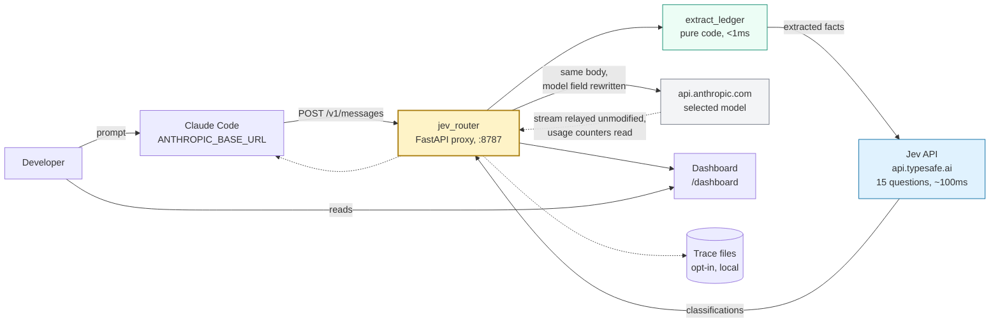
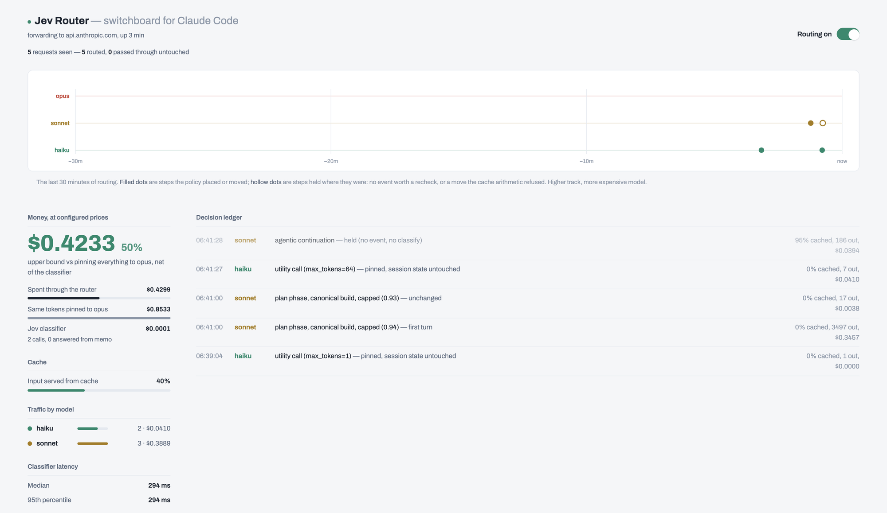

# claude-code-jev-smart-router

An HTTP proxy for Claude Code. It intercepts `POST /v1/messages`, classifies what
the request is doing, rewrites the `model` field to a cheaper model when the work
allows it, and forwards to `api.anthropic.com`. Only that field changes. Response
streams are relayed unmodified.

## Results

**74% cheaper. 2.4x faster. Matched Opus on every task.**

63 runs across two matrices. The first set of tasks has a right answer, which
makes it the stronger evidence.

### Tasks with a right answer

Defects planted in the subject file on purpose, or a hidden test suite. Scoring
is a count against ground truth written before the task ran, so no model grades
anything. Median of three runs per cell.

| Task | Pinned Opus | Pinned Haiku | Router |
| --- | --- | --- | --- |
| `bugfind` find 6 planted defects in an order and refund module | 6/6 | **4/6** | **6/6** |
| `secfind` find 6 planted vulnerabilities in a Flask service | 6/6 | **5/6** | **6/6** |
| `algo` implement a prose spec, graded by 20 hidden tests | 20/20 | 20/20 | 20/20 |

| | Pinned Opus | Pinned Haiku | Router |
| --- | --- | --- | --- |
| Cost, 9 runs | $4.50 | $0.63 | **$1.15** |
| Against Opus | | 86% less | **74% less** |
| Mean wall clock | 97 s | 41 s | **40 s** |
| Runs meeting every requirement | 9/9 | **3/9** | **7/9** |

Haiku on its own is 86% cheaper and does not hold up: 3 of 9 runs met every
requirement, it never scored above 4 of 6 on `bugfind`, and it missed the retry
double-charge defect in all three attempts. That is what the cheap tier costs
you, and it is the figure a quality score could not produce.

The router matched Opus on the median score of all three tasks for a quarter of
the money. It is not risk free either: 7 of 9 runs were perfect, not 9. One
`bugfind` run scored 4/6 and one `algo` run 19/20.

`algo` did not discriminate. All three arms scored 20/20, so a tight written spec
appears to carry a weak model through edge cases it would otherwise miss. It is
useful as a regression check rather than as a comparator.

### Tasks built from scratch

Scored by driving the result: a browser uses the app, the SVG is opened, the
analysis scripts are executed. Median of three runs.

| | `todo` | `pelican` | `datasci` |
| --- | --- | --- | --- |
| Requirements met, routed | 9/9 | 5/5 | 10/10 |
| Requirements met, pinned Opus | 9/9 | 5/5 | 10/10 |
| Cost, pinned Opus | $0.2662 | $0.3565 | $0.8573 |
| Cost, routed | $0.1093 | $0.0870 | $0.2427 |
| **Saving** | **58.9%** | **75.5%** | **71.6%** |
| Wall clock, pinned Opus | 38.1 s | 90.7 s | 191.7 s |
| Wall clock, routed | 29.8 s | 23.2 s | 106.8 s |
| Quality score, Opus then routed | 4/5, 4/5 | 4/5, 3/5 | 5/5, 4/5 |

Across the whole benchmark, classification cost **$0.0087 to route $21.77** of
work, at a median 266 ms per decision. Routing overhead is about one part in two
thousand.

### What was asked

| Task | Prompt |
| --- | --- |
| `bugfind` | Review orders.py, a production order and refund module, and write up every defect with its line and a fix. |
| `secfind` | Security review of an internal Flask invoice service reachable by any employee. Report each finding with its line, the attack, and a fix. |
| `algo` | Implement `merge_schedules(intervals, tz)` from spec.md, merging intervals that overlap or touch, comparing real elapsed time across both daylight saving transitions. Standard library only. |
| `todo` | Make a to-do app in a single self-contained HTML file: add, complete, delete, edit, filter by all/active/completed, persist to localStorage, show a remaining count. No dependencies. |
| `pelican` | Make a single hand-authored SVG of a pelican riding a bicycle. No external images or fonts. |
| `datasci` | Generate 5000 rows of synthetic retail sales data with seasonality and anomalies, analyse it with pandas, and write up the findings. |

### How it was measured

Costs come from token counts read by the proxy, which sits in the request path on
every arm including the pinned controls. Claude Code's own cost figure is not
used: it attributes usage to the model it requested rather than the one that
served, so on a routed run it prices Sonnet tokens at Opus rates and reports no
saving at all.

**Scoring is pass or fail per requirement, and no model decides it.**

For the planted tasks the answer key is written before the task runs and is never
copied into the working directory. A defect counts as found only when the review
names the relevant symbol and a phrase specific to that defect class in the same
passage; a review listing every function and no defect scores zero. `algo` is
graded by running the hidden suite, and a reference solution passes all 20.

For the built tasks the artifact is driven rather than inspected. The to-do app
is loaded in a headless browser and used: type a task, press Enter, tick it off,
filter, rename it, reload the page, delete it.

This catches what file inspection does not. One build had an Add button and a
handler calling `getElementById('taskInput')`, and no text input anywhere in the
file. It parsed clean and failed on first use.

**Quality score**, where shown, is a separate blind judgement against a per-task
rubric with arm labels stripped and a ranking pass run twice with the order
swapped. On the planted tasks it is redundant, because the count is the answer.

Harness, fixtures and per-run data: [`bench/`](bench/) and
[`bench/RESULTS.md`](bench/RESULTS.md).

## How it works

It listens on `ANTHROPIC_BASE_URL`, intercepts `POST /v1/messages`, extracts
facts about the session from the request body, sends those facts to the Jev API
for classification, maps the response to a model, and forwards upstream with only
the `model` field rewritten.

| File | Contents | Dependencies |
| --- | --- | --- |
| `jev_ontology.py` | Fact extraction, the question set, the tier policy | stdlib only |
| `jev_router.py` | The proxy, cache cost arithmetic, telemetry, dashboard | fastapi, httpx |

On a Pro, Max or Team subscription there is no per-token bill, so routing
consumes less of the plan's allowance rather than reducing a charge.

### Prompt cache constraint

Each model has a separate cache, so a mid-conversation switch makes the new model
re-read the conversation prefix at full input price. In a long session that
prefix is most of the token volume, so switching on every request can cost more
than using one model throughout.

The proxy prices each switch against the cache rebuild it causes and applies it
only when it pays back within a few turns. See
[Cache management](#cache-management).

## The classifier

Per-request routing needs classification inside the request path. A
general-purpose model prompted to classify would add seconds and a token bill to
every request, which is most of what the routing saves.

Jev is a classification model rather than a generative one, served by TypeSafe at
`api.typesafe.ai/v1/systemone`.

**One round trip for the whole question set.** Extracted facts and every question
go in a single POST. A user turn sends 15 questions; a mid-run recheck sends the
12 that do not depend on a new user message:

```http
POST https://api.typesafe.ai/v1/systemone
Authorization: Bearer $TYPESAFE_API_KEY
Content-Type: application/json

{"model": "jev-latest",
 "state": "<extracted session facts>",
 "questions": { ... }}
```

**Typed answers.** Each question declares its type and the response supplies that
type. `choice` returns a label from the definition set sent with the question,
`score` returns an ordinal, `noul` returns a likelihood between 0 and 1:

```json
{"answers": {
   "phase":            {"choice": "debug", "confidence": 0.82},
   "next_step_demand": {"score": 2,        "confidence": 0.71},
   "risk_surface":     {"noul": 0.88,      "confidence": 0.90}
 },
 "usage": {"input_tokens": 501}}
```

(Abridged. Field names are as the router reads them; values are illustrative.)

**Per-answer confidence.** When confidence in `phase` falls below
`ROUTER_MIN_CONFIDENCE`, that answer is discarded and the deterministic
tool-derived phase hint is used instead. Demand adjustments are gated the same
way. The decision is split into many small questions because the model is
calibrated per individual judgment; the weighing happens afterwards in
`pick_tier_v2`.

Any error, timeout or non-200 returns no answers, at which point the session
keeps its current tier or the request forwards as received.

## Status

Proof of concept. Specifically:

- Requires a TypeSafe API key. Without one, every request forwards unrouted.
- The thresholds in the tier policy are unfitted defaults, not measured values.
- Benchmarked on six tasks, 63 runs, one machine. On other workloads prompt
  caching can make per-request routing cost more than a single pinned model.
  Run [`bench/`](bench/) on your own tasks before relying on the numbers.
- The `risk_surface` floor did not engage on the security review task. It is
  gated on the phase being `implement`, `debug`, `review` or `plan`
  (`jev_ontology.py:772`), and a review session opens in `explore`, so the floor
  is skipped even with the risk signal at 0.75 and no check running.
- The default prices in `ROUTER_PRICES` were verified by solving each rate from
  observed token counts against billed cost. Re-verify when pricing changes:
  the breakeven arithmetic depends on them, and a stale table changes which
  model gets picked, not just what the dashboard reports.

## Routing logic

Claude Code already changes models in three situations: `opusplan` at the plan
boundary, `fallbackModel` on request failure, and automatic fallback on a safety
classifier. None of them consider task difficulty.

Routing on prompt length does not work either. A one-line request to rotate a
credential is harder and riskier than a thousand-line file to reformat.

This proxy classifies each request along two dimensions:

1. **Task phase.** One of nine software lifecycle phases: `clarify`, `explore`,
   `plan`, `implement`, `debug`, `verify`, `review`, `integrate`,
   `housekeeping`. Each phase has a default tier.
2. **Cost of an undetected error.** Whether a check the agent is already running
   would catch a mistake (`oracle_in_loop`), whether the work touches sensitive
   code such as authentication or migrations (`risk_surface`), and whether the
   next step acts outside the working tree (`irreversible`).

Both dimensions are combined by a sequence of conditionals in `pick_tier_v2`,
with every threshold a hardcoded default. Each branch and value is listed in
[docs/ONTOLOGY.md](docs/ONTOLOGY.md).

Resulting tiers for `phase = implement`:


Rows 3 and 4 set a floor. The cache cost check described below cannot select a
tier below a floor.

## Cache management

Each model maintains a separate prompt cache. Switching models mid-conversation
causes the new model to re-read the conversation prefix at full input price. On
long sessions that prefix is most of the token volume, so unconditional
per-request switching can cost more than pinning a single model.

The proxy therefore prices each switch before making it. `switch_delta()`
returns a per-turn saving and a one-time cost:

```
one_time  = prefix_tokens * ROUTER_CACHE_WRITE_MULT * in_price(target) / 1e6
per_turn  = current_turn_cost - target_turn_cost
```

Three cases:

| Cache state | Behavior |
| --- | --- |
| Cold (no request within `ROUTER_CACHE_TTL_SAFE`, default 2880s) | Switch. There is no warm prefix to rebuild. |
| Warm, downgrade requested | Switch only if `per_turn * ROUTER_SWITCH_HORIZON > one_time` |
| Warm, upgrade requested | Switch immediately, without pricing |

Input token prices are read from the relayed response stream
(`input_tokens`, `cache_read_input_tokens`, `cache_creation_input_tokens`), not
estimated. Prices per model come from `ROUTER_PRICES`.

A tier is a price per token, not a cost per task. A cheaper model that emits
more tokens or takes more turns can cost more per completed task, so
`switch_delta` prices each side using that model's observed output volume. If the
cheaper model's measured output rate is high enough, the saving is negative and
no switch occurs.

## Fact extraction

Facts are computed from the request body in code, not asked of the classifier.
`extract_ledger(body)` is a pure function, recomputed each request rather than
cached, so it survives restarts.

| Table | Purpose |
| --- | --- |
| `TOOL_KINDS` | 29 tool names mapped to 11 kinds (`read`, `search`, `edit`, `bash`, `subagent`, `todo`, `skill`, `plan`, `ask`, `web`, `meta`) |
| `BASH_CLASSES` | 8 bash command classes, checked in order, most consequential match wins |
| `FAIL_TEXT` / `PASS_TEXT` | Whether a tool result indicates a failed check |
| `RISK_SURFACE` | Regex for sensitive paths and identifiers |
| `ROLE_SNIFF` | Subagent role inferred from the `system` field |

Tool definitions are forwarded unchanged. The proxy does not filter, reorder or
block tools.

## Architecture



Passed through unmodified: the client credential, `cache_control` markers, the
`system` block array and its ordering, `anthropic-beta`, `anthropic-version`, and
the `?beta=true` query parameter. See
[docs/ARCHITECTURE.md](docs/ARCHITECTURE.md) for the full compliance list and the
known gaps.

## Installation

```bash
pip install -r requirements.txt

export TYPESAFE_API_KEY=...        # console.typesafe.ai/settings/keys
uvicorn jev_router:app --port 8787
```

Run a single worker. Session state is in-process, so `--workers N` routes
same-session requests to processes with different state.

Bind to loopback. The `/router/*` control endpoints have no authentication.

## Connecting Claude Code

### Subscription (Pro, Max, Team)

```bash
export ANTHROPIC_BASE_URL=http://127.0.0.1:8787
claude
```

Do not set `ANTHROPIC_API_KEY` or `ANTHROPIC_AUTH_TOKEN` on this path, and do not
run `/logout`. Setting `ANTHROPIC_BASE_URL` alone does not replace the
subscription: requests route through the proxy while the saved claude.ai login
remains the active credential. Setting a gateway credential replaces the
subscription, and traffic then bills per token to the owner of that credential.

On a subscription, routing conserves usage limit rather than reducing a bill.
Claude Code also stops validating plan requirements behind a gateway, so
`ROUTER_TIERS` must list only models the plan serves.

### API key

```bash
export ANTHROPIC_API_KEY=sk-ant-...   # used only if the client sends no credential
export ANTHROPIC_BASE_URL=http://127.0.0.1:8787
claude
```

To persist, add to `~/.claude/settings.json`:

```json
{
  "env": {
    "ANTHROPIC_BASE_URL": "http://127.0.0.1:8787"
  }
}
```

Configuration reference for all 28 environment variables, and how to keep
`/model` working as a manual override, is in
[docs/DEVELOPER.md](docs/DEVELOPER.md).

## Dashboard

`GET /dashboard` serves a single HTML page with no build step, polling
`/router/metrics` every 2.5 seconds. It displays:

- Decisions over the last 30 minutes. Filled marks are switches, hollow marks are
  holds, height is the price tier.
- Spend compared against a baseline of pinning the highest tier.
- Cache hit ratio, request counts per model, classifier p50 and p95 latency.
- A decision log with the reason and cost arithmetic for each selection.
- A toggle that disables routing without restarting.



The spend comparison on that page is an upper bound. It reprices the proxy's own
token counts at the highest tier, so extra turns taken by a weaker model are
billed into the comparison at top-tier rates. For an accurate figure, run the
same task pinned and routed with [`bench/`](bench/).

## Limitations

- **Observation only.** Tool calls appear in the request body after they have
  run, so `irreversible` predicts the next step and cannot block the previous
  one. Use a `PreToolUse` hook or `permissions.deny` to block actions.
- **Single process.** Session state is a tier index and counters in memory,
  capped at 512 sessions.
- **No image input to the classifier.** Requests containing screenshots are
  classified on their text and extracted facts only.
- **Tool names change between Claude Code releases.** `Task` versus `Agent`,
  `TodoWrite` versus `TaskCreate`, and current macOS and Linux builds omit `Grep`
  and `Glob`. All name-dependent tables are at the top of `jev_ontology.py`.
- **`count_tokens` is forwarded without rewriting its model field**, so
  `/context` reports the model Claude Code believes it is using.
- **Only the Anthropic Messages format is served.** Not Bedrock, not Agent
  Platform.
- Anthropic does not endorse, maintain or audit third-party gateways, and does
  not support routing Claude Code to non-Claude models through one.

## Documentation

| File | Contents |
| --- | --- |
| [docs/ARCHITECTURE.md](docs/ARCHITECTURE.md) | Request lifecycle, decision order, cache cost arithmetic, state, failure handling, protocol compliance |
| [docs/ONTOLOGY.md](docs/ONTOLOGY.md) | The nine phases, the 15 questions with their definitions, the `pick_tier_v2` conditionals |
| [docs/DEVELOPER.md](docs/DEVELOPER.md) | Installation, endpoint list, all 28 environment variables, tracing and calibration, troubleshooting |

`ROUTING NOTES` at the end of `jev_router.py` contains the author's commentary on
the cache interaction and is more current than these documents.

## Measuring cost impact

Do not use Claude Code's own `/cost`. It attributes usage to the model it
requested, not the one the router served, so on a routed session it prices
Sonnet and Haiku tokens at Opus rates and reports no saving at all.

Use the harness in [`bench/`](bench/). It runs a task pinned to Opus and routed,
counts both through the router, drives the resulting artifact to check the work
was actually done, and writes a report:

```bash
export TYPESAFE_API_KEY=...
python3 bench/preflight.py --live     # setup checks, costs under a cent
python3 bench/calibrate_prices.py     # solve the real per-model rates
python3 bench/run_bench.py --pilot    # 2 tasks, both arms
python3 bench/collect.py <stamp>      # costs, from router token counts
python3 bench/fr_check.py <stamp>     # did it meet the requirements
python3 bench/judge.py <stamp>        # blind quality scoring
python3 bench/report.py <stamp>       # writes bench/RESULTS.md
```

Add your own tasks in `bench/tasks.py`. Three tasks on one machine is not a
general claim, and neither is anything measured on somebody else's workload.

## License

MIT. See [LICENSE](LICENSE).
