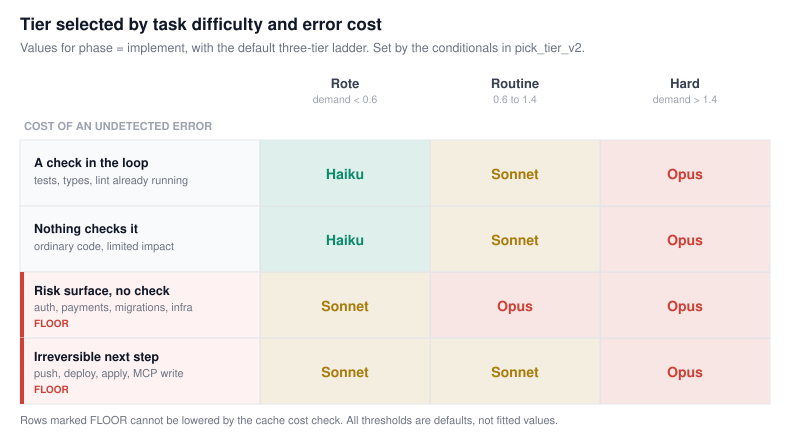
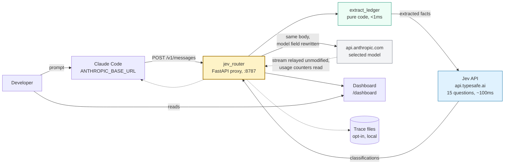

# claude-code-jev-smart-router

An HTTP proxy for Claude Code that selects the Claude model per request.

It listens on `ANTHROPIC_BASE_URL`, intercepts `POST /v1/messages`, extracts
facts about the session from the request body, sends those facts to the Jev API
for classification, maps the response to a model, and forwards the request
upstream to `api.anthropic.com` with only the `model` field rewritten. Response
streams are relayed unmodified.

Two modules:

| File | Contents | Dependencies |
| --- | --- | --- |
| `jev_ontology.py` | Fact extraction, the question set, the tier policy | stdlib only |
| `jev_router.py` | The proxy, cache cost arithmetic, telemetry, dashboard | fastapi, httpx |

## Status

Proof of concept. Specifically:

- Requires a TypeSafe API key. Without one, every request forwards unrouted.
- The thresholds in the tier policy are unfitted defaults, not measured values.
- Savings are unverified. Prompt caching can make per-request routing more
  expensive than a single pinned model. Measure before relying on it.

## Routing logic

Claude Code already changes models in three situations: `opusplan` at the plan
boundary, `fallbackModel` on request failure, and automatic fallback on a safety
classifier. None of them consider task difficulty.

Routing on prompt length does not work either. A one-line request to rotate a
credential is harder and riskier than a thousand-line file to reformat.

This proxy classifies each request along two dimensions:

1. **Task phase.** One of nine software lifecycle phases: `clarify`, `explore`,
   `plan`, `implement`, `debug`, `verify`, `review`, `integrate`,
   `housekeeping`. Each phase has a default tier.
2. **Cost of an undetected error.** Whether a check the agent is already running
   would catch a mistake (`oracle_in_loop`), whether the work touches sensitive
   code such as authentication or migrations (`risk_surface`), and whether the
   next step acts outside the working tree (`irreversible`).

The source states the intent as `tier = cognitive demand x cost of an undetected
error` (`jev_ontology.py:28`). In practice it is a sequence of conditionals in
`pick_tier_v2`, documented in [docs/ONTOLOGY.md](docs/ONTOLOGY.md).

Resulting tiers for `phase = implement`:



Rows 3 and 4 set a floor. The cache cost check described below cannot select a
tier below a floor.

## Cache management

Each model maintains a separate prompt cache. Switching models mid-conversation
causes the new model to re-read the conversation prefix at full input price. On
long sessions that prefix is most of the token volume, so unconditional
per-request switching can cost more than pinning a single model.

The proxy therefore prices each switch before making it. `switch_delta()`
returns a per-turn saving and a one-time cost:

```
one_time  = prefix_tokens * ROUTER_CACHE_WRITE_MULT * in_price(target) / 1e6
per_turn  = current_turn_cost - target_turn_cost
```

Three cases:

| Cache state | Behavior |
| --- | --- |
| Cold (no request within `ROUTER_CACHE_TTL_SAFE`, default 240s) | Switch. Nothing to lose. |
| Warm, downgrade requested | Switch only if `per_turn * ROUTER_SWITCH_HORIZON > one_time` |
| Warm, upgrade requested | Switch immediately, without pricing |

Input token prices are read from the relayed response stream
(`input_tokens`, `cache_read_input_tokens`, `cache_creation_input_tokens`), not
estimated. Prices per model come from `ROUTER_PRICES`.

Note that a tier is a price per token, not a cost per task. A cheaper model that
emits more tokens or takes more turns can cost more per completed task, so
`switch_delta` prices each side using that model's observed output volume. If the
cheaper model's measured output rate is high enough, the saving is negative and
no switch occurs.

## Fact extraction

Facts are computed from the request body in code, not asked of the classifier.
`extract_ledger(body)` is a pure function, recomputed each request rather than
cached, so it survives restarts.

| Table | Purpose |
| --- | --- |
| `TOOL_KINDS` | 29 tool names mapped to 11 kinds (`read`, `search`, `edit`, `bash`, `subagent`, `todo`, `skill`, `plan`, `ask`, `web`, `meta`) |
| `BASH_CLASSES` | 8 bash command classes, checked in order, most consequential match wins |
| `FAIL_TEXT` / `PASS_TEXT` | Whether a tool result indicates a failed check |
| `RISK_SURFACE` | Regex for sensitive paths and identifiers |
| `ROLE_SNIFF` | Subagent role inferred from the `system` field |

Tool definitions are forwarded unchanged. The proxy does not filter, reorder or
block tools.

## Architecture



Passed through unmodified: the client credential, `cache_control` markers, the
`system` block array and its ordering, `anthropic-beta`, `anthropic-version`, and
the `?beta=true` query parameter. See
[docs/ARCHITECTURE.md](docs/ARCHITECTURE.md) for the full compliance list and the
known gaps.

## Installation

```bash
pip install -r requirements.txt

export TYPESAFE_API_KEY=...        # console.typesafe.ai/settings/keys
uvicorn jev_router:app --port 8787
```

Run a single worker. Session state is in-process, so `--workers N` routes
same-session requests to processes with different state.

Bind to loopback. The `/router/*` control endpoints have no authentication.

## Connecting Claude Code

### Subscription (Pro, Max, Team)

```bash
export ANTHROPIC_BASE_URL=http://127.0.0.1:8787
claude
```

Do not set `ANTHROPIC_API_KEY` or `ANTHROPIC_AUTH_TOKEN` on this path, and do not
run `/logout`. Setting `ANTHROPIC_BASE_URL` alone does not replace the
subscription: requests route through the proxy while the saved claude.ai login
remains the active credential. Setting a gateway credential replaces the
subscription, and traffic then bills per token to the owner of that credential.

On a subscription, routing conserves usage limit rather than reducing a bill.
Claude Code also stops validating plan requirements behind a gateway, so
`ROUTER_TIERS` must list only models the plan serves.

### API key

```bash
export ANTHROPIC_API_KEY=sk-ant-...   # used only if the client sends no credential
export ANTHROPIC_BASE_URL=http://127.0.0.1:8787
claude
```

To persist, add to `~/.claude/settings.json`:

```json
{
  "env": {
    "ANTHROPIC_BASE_URL": "http://127.0.0.1:8787"
  }
}
```

Configuration reference for all 28 environment variables, and how to keep
`/model` working as a manual override, is in
[docs/DEVELOPER.md](docs/DEVELOPER.md).

## Dashboard

`GET /dashboard` serves a single HTML page with no build step, polling
`/router/metrics` every 2.5 seconds. It displays:

- Decisions over the last 30 minutes. Filled marks are switches, hollow marks are
  holds, height is the price tier.
- Spend compared against a baseline of pinning the highest tier.
- Cache hit ratio, request counts per model, classifier p50 and p95 latency.
- A decision log with the reason and cost arithmetic for each selection.
- A toggle that disables routing without restarting.

<!-- Screenshot to come: docs/img/dashboard.png -->

The spend comparison on that page is an upper bound. It prices the weaker model's
additional turns at the highest tier. Trace data gives an accurate figure.

## Limitations

- **Observation only.** Tool calls appear in the request body after they have
  run, so `irreversible` predicts the next step and cannot block the previous
  one. Use a `PreToolUse` hook or `permissions.deny` to block actions.
- **Single process.** Session state is a tier index and counters in memory,
  capped at 512 sessions.
- **No image input to the classifier.** Requests containing screenshots are
  classified on their text and extracted facts only.
- **Tool names change between Claude Code releases.** `Task` versus `Agent`,
  `TodoWrite` versus `TaskCreate`, and current macOS and Linux builds omit `Grep`
  and `Glob`. All name-dependent tables are at the top of `jev_ontology.py`.
- **`count_tokens` is forwarded without rewriting its model field**, so
  `/context` reports the model Claude Code believes it is using.
- **Only the Anthropic Messages format is served.** Not Bedrock, not Agent
  Platform.
- Anthropic does not endorse, maintain or audit third-party gateways, and does
  not support routing Claude Code to non-Claude models through one.

## Documentation

| File | Contents |
| --- | --- |
| [docs/ARCHITECTURE.md](docs/ARCHITECTURE.md) | Request lifecycle, decision order, cache cost arithmetic, state, failure handling, protocol compliance |
| [docs/ONTOLOGY.md](docs/ONTOLOGY.md) | The nine phases, the 15 questions with their definitions, the `pick_tier_v2` conditionals |
| [docs/DEVELOPER.md](docs/DEVELOPER.md) | Installation, endpoint list, all 28 environment variables, tracing and calibration, troubleshooting |

`ROUTING NOTES` at the end of `jev_router.py` contains the author's commentary on
the cache interaction and is more current than these documents.

## Measuring it

Run one week with a pinned model, one week routed, and compare `/cost`. On a
subscription, compare how often you hit usage limits instead.

## License

MIT. See [LICENSE](LICENSE).
