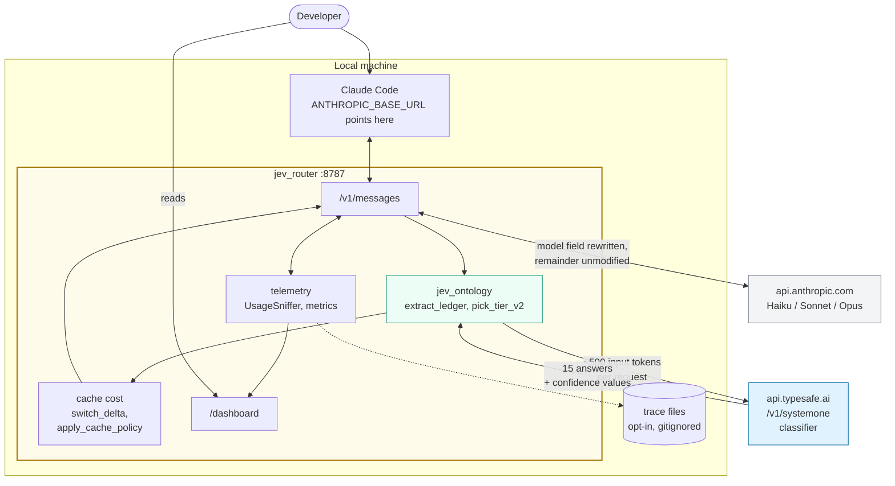
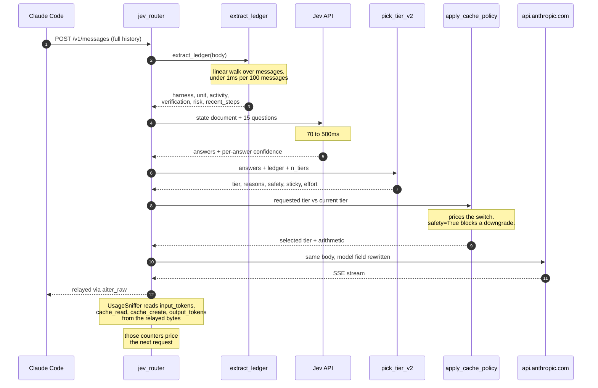
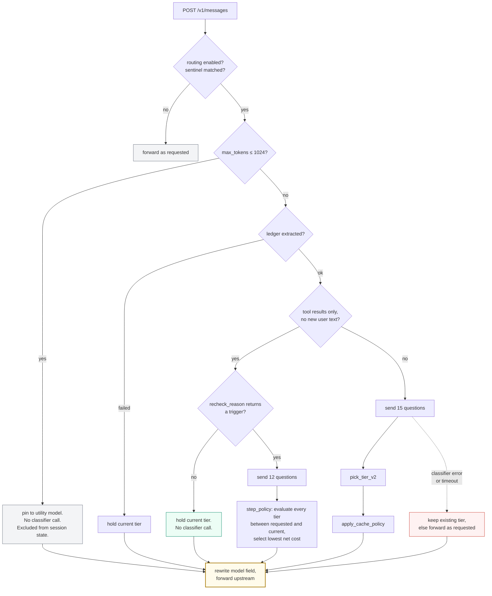

# Architecture

## Module split

| | `jev_ontology.py` | `jev_router.py` |
| --- | --- | --- |
| Responsibility | Fact extraction, question set, tier policy | Proxy, cache cost arithmetic, telemetry, dashboard |
| Output | Which tier the request maps to | Which tier is actually used |
| Side effects | None. Pure functions, no state, stdlib only. | All network I/O, all state |
| Lines | 957 | 1788 |

The policy module performs no I/O and holds no state, so its thresholds can be
re-derived from trace data without modifying the proxy.

## Context diagram



External dependencies: Claude Code as the client, `api.typesafe.ai` for
classification, `api.anthropic.com` for inference. No database, no cache server,
no message queue.

## Request lifecycle



Step 12 uses measured token counts rather than estimates. Two consequences in the
implementation:

- `accept-encoding` is forced to `identity` on the forward, so the response body
  is readable.
- The sniffer buffers a 16KB head, because `message_start` carries the cache
  counters and a smaller window undercounts the prefix.

## Decision order

Cheap checks run first. Most requests do not reach the classifier.



### Utility pin

Claude Code issues small sidecar requests within a session: permission
classifiers, quota probes, topic detection. These have verdict-sized `max_tokens`
and responses of around nine tokens.

Requests at or below `ROUTER_UTILITY_MAX_TOKENS` are pinned to
`ROUTER_UTILITY_MODEL`, not classified, and excluded from session state. Without
this exclusion they reset the continuation counter each turn, which prevents
rechecks from firing, and they overwrite the session's prefix and output token
telemetry.

### Continuation hold

A request carrying only tool results is held at the current tier without a
classifier call unless `recheck_reason()` returns a trigger. Triggers are listed
in [ONTOLOGY.md](ONTOLOGY.md#recheck-triggers). `ROUTER_RECHECK_EVERY` is a
fallback cadence used when no trigger fires.

## Tier selection and cache cost

Tier selection and cache cost are separate stages. The first determines which
tier the request maps to; the second determines whether changing to it is
cheaper than staying.

```mermaid
flowchart TB
    subgraph want["Stage 1: tier selection (jev_ontology)"]
        direction LR
        w1["phase<br/>default tier"] --> w2["demand<br/>&plusmn;1, clamped"] --> w3["error cost<br/>oracle, risk, irreversible"] --> w4["trajectory<br/>thrashing, drifting,<br/>user_correcting"]
    end

    want -->|"tier, safety, sticky, effort"| gate

    subgraph gate["Stage 2: cache cost (jev_router)"]
        direction TB
        g0{"direction?"}
        g0 -->|upgrade| g1["apply immediately,<br/>no pricing"]
        g0 -->|downgrade| g2{"cache warm?<br/>same model, request<br/>within 240s"}
        g2 -->|cold| g3["apply"]
        g2 -->|warm| g4["compute:<br/>per_turn &#215; horizon<br/>vs prefix &#215; 1.25 &#215; in_price"]
        g4 --> g5{"net positive?"}
        g5 -->|yes| g6["apply"]
        g5 -->|no| g7["hold, log arithmetic"]
    end

    safety["safety floor<br/>set by irreversible, risk with<br/>no oracle, thrashing,<br/>user_correcting"]
    safety ==>|"blocks downgrade<br/>below this tier"| gate

    effort["effort steering<br/>same model, lower effort.<br/>Cache unaffected."]
    gate -.->|"alternative when a<br/>switch is not cheaper"| effort

    style want fill:#ecfdf5,stroke:#0c8a6c,stroke-width:2px
    style gate fill:#fffbeb,stroke:#a87b0b,stroke-width:2px
    style safety fill:#fef2f2,stroke:#cb4136,stroke-width:2px
    style effort fill:#e0f2fe,stroke:#0369a1
```



Upgrades are applied without pricing. Downgrades are priced. Safety floors are
recomputed at each recheck and lift when their cause is no longer present, except
`user_correcting`, which persists for the remainder of the work unit.

## Cache cost arithmetic

Claude Code caches the system prompt and conversation prefix. Each model has its
own cache, so switching models causes the new model to re-read the prefix at full
input price.

Billing multiples, configurable:

| | Multiple of base input price | Variable |
| --- | --- | --- |
| Cache read | 0.10 | `ROUTER_CACHE_HIT_MULT` |
| Cache write, 5 minute TTL | 1.25 | `ROUTER_CACHE_WRITE_MULT` |

The TTL is measured from the start of the request that touched the cache, so the
proxy treats the cache as cold after `ROUTER_CACHE_TTL_SAFE` seconds, default
240, rather than 300.

`switch_delta(cur, tgt, prefix, pred_out)` returns `(per_turn_saving,
one_time_cost)`:

```
one_time_cost   = prefix * CACHE_WRITE_MULT * in_price(tgt) / 1e6
per_turn_saving = turn_cost(cur) - turn_cost(tgt)
```

where `turn_cost` prices the cached prefix at `CACHE_HIT_MULT` plus that model's
expected output volume. Three cases:

| Cache state | Condition to switch |
| --- | --- |
| Cold | none, switch |
| Warm, downgrade | `per_turn_saving * ROUTER_SWITCH_HORIZON > one_time_cost` |
| Warm, upgrade | none, switch |

Subagent requests are short-lived and start cache-cold, so switching costs
nothing there. Subagents hold their own tier state, keyed on the agent id.

### Per-token price versus per-task cost

`ROUTER_TIERS` is ordered by list price. It is not necessarily ordered by cost per
completed task, because a cheaper model may emit more tokens or require more
agentic turns.

Reported measurement, for context rather than as a general result: Artificial
Analysis measured Sonnet 5 at max effort costing approximately 15% more per task
than Opus 4.8, from token volume alone, with max effort taking roughly 6x the
agentic turns of low effort. That comparison used max effort, Opus 4.8 rather than
Opus 5, and their task mix.

How the implementation handles this:

- `switch_delta` prices each model using its own expected output volume, tracked
  as an EMA per model and reported as `out_rate` in `/router/metrics`.
- That measured ratio is confounded, since tiers receive different work. It is
  clamped to `[0.5, 3.0]` and applied as a correction.
- `ROUTER_EFFORT_STEERING=1` lowers effort on the same model instead of switching
  models, which leaves the cache intact. Top-level effort changes are not made,
  since they invalidate the cache in the same way a model switch does.
- A middle tier can be removed from `ROUTER_TIERS` if trace data shows it costs
  more per completed task than the highest tier.

## State

In-process, approximately a few kilobytes.

| Contents | Structure | Bound |
| --- | --- | --- |
| Tier, counters, last model, last usage, per session and subagent | `_state` | 512 entries, oldest evicted |
| Recent classifications, keyed by question set + state hash | `_memo` | 64 entries, no TTL |
| Output rate EMA per model | `_out_rate` | one entry per model |
| Decisions, classifier latencies | `_metrics` | 120 and 300, ring buffers |

Session identity is `x-claude-code-session-id` plus `x-claude-code-agent-id`, so
the main thread and each subagent hold separate tier state.

No conversation content is stored. The Messages API is stateless and Claude Code
resends the full history each request, so the ledger is recomputed rather than
retained.

`_memo` exists because Claude Code retries with an identical body. Without it, a
retry could be assigned a different model than the attempt it retries, which
invalidates the cache.

A shared store such as Redis becomes necessary only when running more than one
worker, since same-session requests would otherwise reach processes with
different tier state. Key on `x-claude-code-session-id`.

## Failure handling

No failure in the classification path terminates a request.

| Function | On exception |
| --- | --- |
| `classify()` | returns `None`. Session keeps its existing tier, or forwards as requested. |
| `safe_ledger()` | returns `None`, tier is held |
| `trace()` | swallowed |
| `record_usage()` | swallowed |

Other handling:

- Upstream status codes and error bodies relay unmodified on both streaming and
  non-streaming paths, so Claude Code's retry logic still applies.
- A 400 rejecting the `context-1m` beta token drops it and retries once.
- A 400 rejecting an effort marker disables effort steering process-wide and
  retries without markers.
- Stream interruptions are distinguished between client disconnect
  (`CancelledError`, `ClientDisconnect`) and upstream failure (httpx errors).

## Protocol compliance

Verified behaviors:

- `anthropic-beta` and `anthropic-version` forwarded verbatim, not allowlisted by
  value. On a subscription, `anthropic-beta` carries an OAuth capability and
  removing it causes a 401 on every request.
- The client credential is forwarded unmodified. `ANTHROPIC_API_KEY` is injected
  only when the client sends no credential.
- The `?beta=true` query parameter is preserved.
- The `system` array is forwarded unchanged, preserving block order.
- `cache_control` markers are forwarded wherever they appear.
- Responses stream via `aiter_raw`, so SSE pings reach Claude Code's 300 second
  byte watchdog unbuffered.

Known gaps:

- `count_tokens` is forwarded without rewriting its model field, so `/context`
  reports the model Claude Code believes it is using.
- Only the Anthropic Messages format is served. Bedrock and Agent Platform
  formats are not.
- The request body is buffered in order to classify it. Claude Code sends complete
  bodies, so this adds no latency, but the proxy is not a pure relay.
- Fast mode's availability check and the WebFetch domain safety check call
  `api.anthropic.com` directly and do not pass through the proxy.

There is no compliance test script in this repository. These behaviors were
verified by reading the implementation. Re-check after each Claude Code release.

## Related documents

- [ONTOLOGY.md](ONTOLOGY.md) for the question set and tier policy.
- [DEVELOPER.md](DEVELOPER.md) for configuration and operation.
- `ROUTING NOTES`, end of `jev_router.py`.
