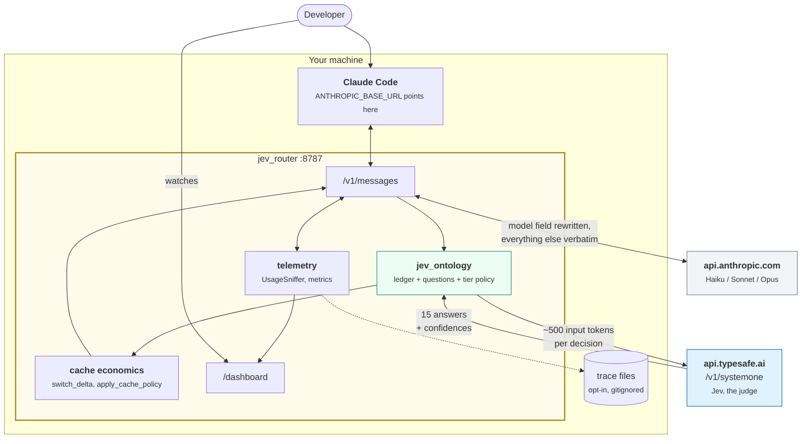
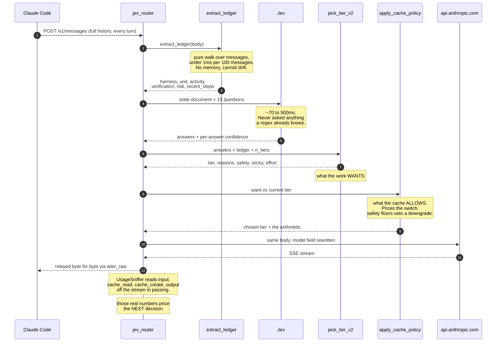
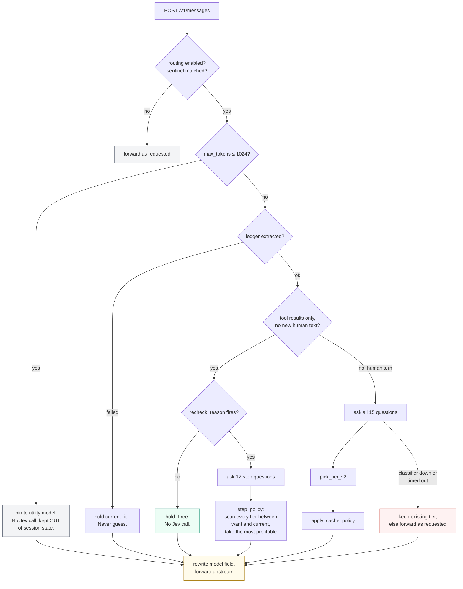

# Architecture

Two modules, one process, a strict split of responsibility.

| | `jev_ontology.py` | `jev_router.py` |
| --- | --- | --- |
| Owns | what Jev is asked and what Jev sees | the proxy, cache economics, telemetry, dashboard |
| Answers | what tier does the work **want** | does moving there **pay** |
| Purity | pure functions, no I/O, no state, stdlib only | all network, all state, all money |
| Size | 957 lines | 1788 lines |

The ontology cannot spend money and the router cannot form an opinion. That
separation is deliberate and worth preserving: it means you can recalibrate every
threshold in the policy from trace data without touching the proxy, and you can
fix a proxy bug without reasoning about routing.

## Context

Three external dependencies and nothing else: Claude Code upstream of you, Jev
for judgment, Anthropic for the actual work. No database, no Redis, no queue.

## The request lifecycle

Step 12 is the part people get wrong when they build one of these. Prefix size
and cache warmth are **measured off the responses being relayed**, not guessed
from a token estimate. That is why `accept-encoding` is forced to `identity` on
the forward, and why the sniffer accumulates a 16KB head: `message_start`
carries the cache fields, and a partial window undercounts the prefix by orders
of magnitude.

## The decision tree

The order matters and it is cheap-checks-first. Most requests never reach Jev.

Two filters do most of the work:

**The utility pin.** Claude Code interleaves tiny sidecar calls into the same
session: permission classifiers, quota probes, topic detection. Verdict-sized
`max_tokens`, nine-token responses. They are not conversation turns. Left
unfiltered they reset the continuation counter every turn, which starves
rechecks, and they overwrite the session's prefix and output telemetry with
their own. So they are pinned, never classified, and kept out of routing state.

**The continuation hold.** A turn that carries only tool results is held without
a Jev call unless the ledger says something actually happened: the phase
shifted, a check failed twice, the same failure came back a third time, a new
risk surface was touched, a skill loaded, or five edits piled up unchecked.
`ROUTER_RECHECK_EVERY` is only the fallback cadence.

## Two layers: what the work wants, and what the cache allows

This is the central design of the thing.

```mermaid
flowchart TB
    subgraph want["Layer 1: what the work WANTS (jev_ontology)"]
        direction LR
        w1["phase<br/><small>base tier</small>"] --> w2["demand<br/><small>&plusmn;1, clamped</small>"] --> w3["blast radius<br/><small>oracle, risk, irreversible</small>"] --> w4["trajectory<br/><small>thrashing, drifting,<br/>user correcting</small>"]
    end

    want -->|"tier + safety + sticky + effort"| gate

    subgraph gate["Layer 2: what the CACHE allows (jev_router)"]
        direction TB
        g0{"direction?"}
        g0 -->|upgrade| g1["take it immediately.<br/><b>Never for sale.</b>"]
        g0 -->|downgrade| g2{"cache warm?<br/><small>same model, seen<br/>within 240s</small>"}
        g2 -->|cold| g3["take it free.<br/>Nothing to lose."]
        g2 -->|warm| g4["price it:<br/>saving &#215; 3 turns<br/>vs prefix &#215; 1.25 &#215; in_price"]
        g4 --> g5{"pays?"}
        g5 -->|yes| g6["switch"]
        g5 -->|no| g7["hold, and log<br/>the arithmetic"]
    end

    safety["<b>safety floor</b><br/><small>irreversible, risk with no check,<br/>thrashing, user correcting</small>"]
    safety ==>|"vetoes any<br/>downgrade below it"| gate

    effort["<b>effort steering</b><br/><small>same model, lower effort.<br/>Cache survives intact.</small>"]
    gate -.->|"the cheap lever<br/>when a switch does not pay"| effort

    style want fill:#ecfdf5,stroke:#0c8a6c,stroke-width:2px
    style gate fill:#fffbeb,stroke:#a87b0b,stroke-width:2px
    style safety fill:#fef2f2,stroke:#cb4136,stroke-width:2px
    style effort fill:#e0f2fe,stroke:#0369a1
```

Upgrades are immediate because no token arithmetic justifies under-serving a hard
turn. Downgrades are priced. Safety floors are re-derived at every recheck and
lift when their cause lifts, except a user correction, which holds for the whole
work unit.

## Why the cache is the whole economics

Claude Code caches the system prompt and the conversation prefix. **Each model
has its own cache.** Switching models mid-conversation means the new model
re-reads the entire prefix at full input price. On a long session that prefix is
the overwhelming majority of your tokens.

Concretely: cache reads bill at 0.10x base input, roughly 90% off. Five-minute
TTL writes bill at 1.25x. The TTL is measured from the **start** of the request
that touched the cache, which is why the router treats the cache as cold after
240 seconds rather than 300.

`switch_delta(cur, tgt, prefix, pred_out)` returns a per-turn saving and a
one-time cost. Three regimes follow:

- **Cache cold.** First turn, or the last request is older than the safe TTL.
  Routing is free. Take the answer. This is where classification earns its keep
  at zero penalty, and it is why subagents are the best place to route: they are
  short-lived and cache-cold, so switching costs nothing.
- **Cache warm, small output ahead.** Staying costs `prefix x 0.10 x in_price`.
  Moving costs `prefix x 1.25 x in_price(target)`. On a 200k prefix the discount
  wins and the router holds.
- **Cache warm, heavy generation ahead.** Output runs about 5x input price and
  the per-model gap is wide, so the rebuild is paid out of
  `pred_out x (out_price_current - out_price_target)`, counted over
  `ROUTER_SWITCH_HORIZON` turns since the saving recurs while the rebuild is paid
  once.

### A tier is a price per token, not a cost per task

The ladder in `ROUTER_TIERS` is ordered by list price. Nothing guarantees it is
ordered by what a finished unit of work costs. Artificial Analysis found Sonnet 5
at max effort costing about 15% **more** per task than Opus 4.8 despite cheaper
per-token pricing, entirely from token volume, with max effort taking roughly 6x
the agentic turns of low. Read that carefully before generalizing: it is max
effort, it is against Opus 4.8 rather than Opus 5, and it is their task mix. What
transfers is the structure, not the number.

The consequences are built into the code:

- `switch_delta` prices each side with its **own** expected output volume,
  learned per model as an EMA and exposed as `out_rate` in `/router/metrics`.
  If the cheaper model talks enough more, the saving goes negative and the
  router stays put.
- The learned ratio is confounded, because tiers get handed different work. It
  is clamped to `[0.5, 3.0]` and treated as a correction, not a truth.
- Effort is the cheaper lever. Lowering effort on the **same** model leaves the
  cache intact, so `ROUTER_EFFORT_STEERING=1` runs rote and routine steps at low
  or medium effort without paying a rebuild. Top-level effort changes are never
  made: those invalidate the cache exactly like a model switch.
- If your traces show the middle tier costing more per finished unit than the top
  one, delete it. A two-rung ladder is a legitimate outcome of measuring.

## State

Small and deliberately in-process. About a few kilobytes.

| What | Where | Bound |
| --- | --- | --- |
| Tier, counters, last model, last usage, per session and per subagent | `_state` | 512 entries, oldest evicted |
| Recent classifications, keyed by question set + state hash | `_memo` | 64 entries, no TTL |
| Per-model output rate EMA | `_out_rate` | one entry per model |
| Decisions, classifier latencies | `_metrics` | 120 and 300, ring buffers |

Session identity is the `x-claude-code-session-id` header plus
`x-claude-code-agent-id`, so the main thread and each subagent hold separate
sticky tiers. No conversation content is ever stored: the Messages API is
stateless and Claude Code resends the full history every turn, so the ledger is
recomputed rather than remembered. It survives a restart and it cannot drift
from reality.

The memo exists for one reason. Claude Code retries with an identical body, and a
retry must land on the same model as the attempt it is retrying, or the cache
breaks for nothing.

**The one case for Redis:** you scale past a single uvicorn worker. Then
same-session requests land on processes with different sticky tiers and
hysteresis quietly stops working. Until then it is a solution to a problem you
do not have.

## Failure behavior

Nothing in the classification path may fail a turn. This is load-bearing.

- `classify()` swallows everything and returns `None`. A session that already has
  a tier keeps it, because bouncing to the requested model would break the cache
  for nothing. A session without one forwards as requested.
- `safe_ledger()` wraps extraction the same way.
- `trace()` and `record_usage()` also swallow everything. Telemetry must never
  take down a turn.
- Upstream status codes and error bodies relay unmodified on both the streaming
  and non-streaming paths, so Claude Code's own retry heuristics still work.
- A 400 rejecting the long-context beta drops that token and retries once. A 400
  rejecting effort markers disables effort steering process-wide and retries
  plain.
- Stream drops are diagnosed apart: client disconnect versus upstream death.
  Knowing which is the whole diagnosis.

Keep it that way if you modify it.

## Protocol compliance

What holds:

- `anthropic-beta` and `anthropic-version` forwarded verbatim, never allowlisted
  by value, because the capability set grows every release. On a subscription
  that header carries an OAuth capability; strip it and every request fails 401.
- The credential arrives and leaves untouched. `ANTHROPIC_API_KEY` is injected
  only when the client sent no credential at all, so it cannot hijack a
  subscription bearer's billing.
- The `?beta=true` query string survives.
- The `system` array passes through unchanged, so the attribution block stays
  first and in its own entry.
- `cache_control` markers pass through wherever they appear. Getting clever here,
  merging blocks or stringifying `system` or reordering, is how gateways
  silently disable caching for their users.
- Responses stream with `aiter_raw`, so SSE pings and comment lines reach Claude
  Code's 300 second byte watchdog unbuffered.

Deliberate gaps:

- `count_tokens` is forwarded without rewriting its model field, so `/context`
  reflects the model Claude Code thinks it is using. Close enough for a gauge.
- Only the Anthropic Messages format is served. Not Bedrock, not Agent Platform.
- The request body is buffered in order to classify it. Claude Code sends
  complete bodies so this costs nothing, but it is not a pure relay.
- Fast mode's availability check and the WebFetch domain safety check call
  `api.anthropic.com` directly and never reach this proxy.

There is no compliance test script in this proof of concept. The assertions above
are documented in `ROUTING NOTES` at the foot of `jev_router.py` and verified by
reading, not by CI. Re-check after each Claude Code release rather than assuming
they still hold.

## See also

- [ONTOLOGY.md](ONTOLOGY.md) for layer 1 in full.
- [DEVELOPER.md](DEVELOPER.md) to run and tune it.
- `ROUTING NOTES`, foot of `jev_router.py`, the authoritative commentary.
