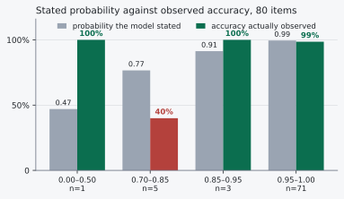
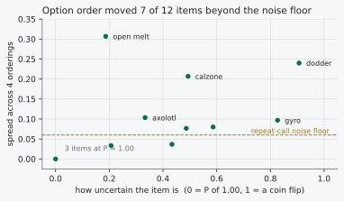

# Is the confidence score trustworthy?

TypeSafe's `jev-latest` classification model outputs probability scores alongside
its decisions. Software relies on these scores to determine routing: if the
probability clears a specific cutoff, the system executes the action
automatically; if it falls below, the task routes to a human. This mechanism
assumes that a stated probability of 0.75 equates to a 75% empirical accuracy
rate.

To test this calibration, 80 adversarial classification items were run against
the model using about 500 API calls on 18 September 2026, at a total cost under
five cents. The inputs were designed so obvious surface features pointed to the
wrong classification. Kelp, for instance, was described as an anchored
photosynthesising organism, to see whether the model would file it as a plant.

## The cutoff paradox

Conventional engineering assumes that raising an automation threshold directly
increases safety. The test data proves this assumption is flawed. You cannot
intuit a safe cutoff; it must be mapped to the actual distribution of model
errors.

| Cutoff | Handled automatically | Sent to human | Wrong answers shipped |
| --- | --- | --- | --- |
| **0.99** | 60 of 80 (75%) | 20 | 0 |
| **0.95** | 71 of 80 (89%) | 9 | 1 |
| **0.85** | 74 of 80 (92%) | 6 | 1 |
| **0.70** | 79 of 80 (99%) | 1 | 4 |

Dropping the threshold from 0.95 to 0.85 increased the automated volume by three
items without shipping a single additional error. The model's one
high-confidence failure, a water mould misclassified as a fungus, carried a
probability of 0.96. Setting a standard 0.95 "safe" threshold therefore costs
automation volume and provides zero additional protection over 0.85 on this
dataset.



## Confident blind spots

The model achieved 95% raw accuracy, 76 of 80. When it reported 0.95 or above it
was correct 70 times out of 71. Its errors are not distributed randomly; they
cluster around semantic traps.

The four failures were kelp (0.70), a diatom (0.77), an axolotl (0.79) and a
water mould (0.96). Three of these share the exact same failure mode. Kelp,
diatoms and water moulds belong to none of the provided biological kingdoms, yet
the model filed all three under the kingdom their physical appearance suggested
rather than selecting the correct `neither` option.

One of the 76 correct answers is not stable. Dodder, a parasitic vine, scored
correct at 0.47 against a rival option at 0.43, and across 20 identical calls it
gave the right answer only 4 times. A rerun would usually score 75 of 80.

Because the model fails confidently on structural blind spots, random 10%
spot-checking of production traffic is insufficient. Sampling 8 of these 80 items
would surface none of the three clustered errors about 73% of the time. A single
conceptual misunderstanding can silently misroute an entire class of inputs at
high confidence.

## Mechanical instability

Testing identical prompts revealed two distinct types of variance in the output
probabilities.

**Run-to-run jitter.** Sending the exact same byte string 20 times resulted in
probabilities fluctuating by about 0.03. If a routing threshold is set at 0.75,
an item evaluating at 0.74 may flip above the threshold on a retry. Cutoffs must
be set at least 0.10 away from high-density case clusters to avoid inconsistent
routing.

**Option ordering.** Changing the sequence of multiple-choice options shifted the
probability by up to 0.31 on certain items, across 12 items tested in four
orderings each.



The largest swing came from an inherently ambiguous edge case: an open-faced tuna
melt offered the labels sandwich, wrap, taco, pastry or none of these. Its
probability of `none of these` read 0.91, 0.60, 0.84 and 0.91 across the four
orderings. For clear-cut items where the model registered 1.00, reordering did
not move the score at all.

The relationship between ambiguity and swing is real but loose: the correlation
across the 12 items is 0.46, and the largest swing came from an item the model
rated 0.91, which is not extreme uncertainty. Seven of the 12 moved further than
run-to-run jitter explains. Rewording the question, by contrast, did nothing: five
paraphrases moved the probability by 0.05 or less.

The practical threat to production routing is the 0.03 jitter straddling cutoff
lines and the confident 0.96 error, not the ordering effect, which is largest
where the answer was never reliable in the first place.

## Limitations of the data

These findings represent one model version on a single day. The 80-item dataset
was intentionally adversarial, meaning the 95% accuracy rate likely understates
the model's performance on standard inputs.

Critically, only the 0.95 and above probability band contained enough items,
n=71, for robust statistical measurement. The mid-tier bands are sparsely
populated: 0.85 to 0.95 holds 3 items, 0.70 to 0.85 holds 5, and below 0.50 holds
1. These lower bins represent anecdotes rather than a reliable calibration curve.
A definitive reliability diagram requires hundreds of labelled items spread
evenly across the probability range.

## Method

Three labelled sets with textbook answers: 35 organisms by kingdom, 22 substances
by element, compound or mixture, and 23 vertebrates by class. Each item was sent
alone, one question per request.

```json
{"model": "jev-latest",
 "state": "A long brown seaweed anchored to the sea bed that photosynthesises.",
 "questions": {"kingdom": {
    "type": "choice",
    "instructions": "Which kingdom does this organism belong to?",
    "criteria": {
      "animal":  "A multicellular organism that ingests other organisms and cannot photosynthesise",
      "plant":   "An organism that makes its own food by photosynthesis",
      "fungus":  "An organism that absorbs nutrients from its surroundings and does not photosynthesise",
      "neither": "Fits none of the above categories"}}}}
```

The roughly 500 calls break down as 80 baseline calls, about 100 repeat calls on
five items, 144 for the ordering test, 45 for a batching comparison, and the rest
for wording and option-set conditions. The ordering test used a separate set of
12 items, including foods, because those produced more genuinely uncertain
answers to move.

Two standard scores, for anyone who wants them. Brier score 0.0379, the squared
gap between the probability given to the correct answer and 1.00, averaged over
all items; spreading probability evenly across the options would score 0.55 here.
Expected calibration error 0.0407, the average distance between what a band
claimed and what it delivered.
