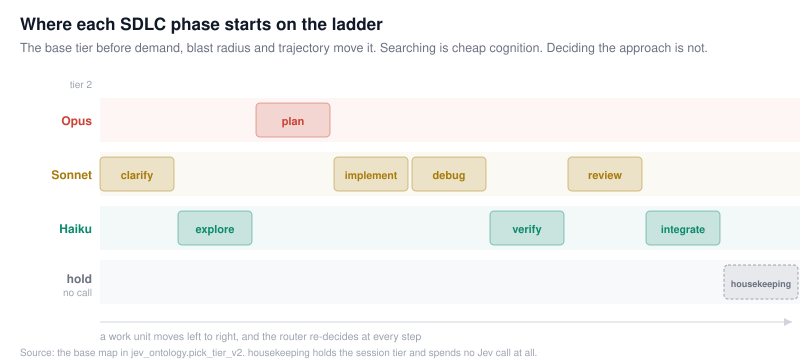
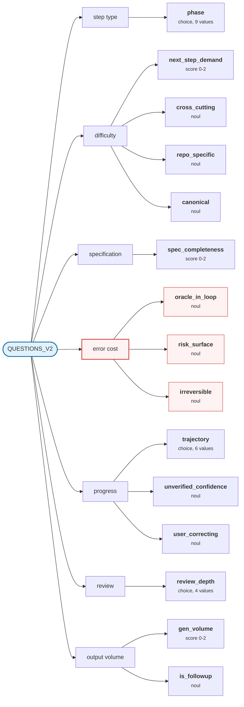

# Question set and tier policy

`jev_ontology.py` maps a request to a tier index. It contains no network I/O, no
state, and no pricing. The proxy decides whether the mapped tier is used.

Public API, as imported by `jev_router.py`:

| Function | Returns |
| --- | --- |
| `extract_ledger(body, *, is_subagent=False)` | facts dict, six sections |
| `build_state_v2(ledger, session=None, *, mid_run=False)` | the string sent to the classifier |
| `pick_tier_v2(answers, ledger, n_tiers, *, current=None, author_tier=None)` | tier, reasons, safety, sticky, effort |
| `recheck_reason(prev, ledger, run_len, every=6)` | trigger string or `None` |
| `ledger_summary(ledger)` | compact dict for change detection |
| `outcome_labels(ledger, answers)` | labels written to traces for calibration |
| `split_human_text(message)` | user text separated from harness wrappers |

Constants also exported: `QUESTIONS_V2`, `STEP_QUESTIONS_V2`, `TOOL_KINDS`.

## Division between extraction and classification

Values computable from the request body are computed in code. The classifier is
sent those values and asked only for judgments that regex cannot produce.

```mermaid
flowchart LR
    body["request body<br/><small>full history, each request</small>"]

    subgraph facts["Computed in code, &lt;1ms, deterministic"]
        direction TB
        f1["<b>TOOL_KINDS</b><br/><small>29 tool names &rarr; 11 kinds</small>"]
        f2["<b>BASH_CLASSES</b><br/><small>8 classes, checked in order</small>"]
        f3["<b>FAIL_TEXT / PASS_TEXT</b><br/><small>check outcome</small>"]
        f4["<b>_failure_signature</b><br/><small>sha1 of normalized<br/>error line</small>"]
        f5["<b>RISK_SURFACE</b><br/><small>regex over paths<br/>and identifiers</small>"]
        f6["<b>system-reminder parse</b><br/><small>plan mode, todos,<br/>CLAUDE.md, skills</small>"]
    end

    subgraph ledger["extract_ledger output: six sections"]
        direction TB
        l1["<b>harness</b><br/><small>agent_role, plan_mode, thinking_budget,<br/>lsp_available, mcp_servers, skills_loaded</small>"]
        l2["<b>unit</b><br/><small>opening_request, latest_human_ask,<br/>human_turns, steps_in_unit, todos</small>"]
        l3["<b>activity</b><br/><small>tool_kinds, bash_classes, files_edited,<br/>lines_changed_est, searches, subagents</small>"]
        l4["<b>verification</b><br/><small>check_runs, last_check,<br/>consecutive_failures, same_failure_repeats,<br/>edits_since_last_check</small>"]
        l5["<b>risk</b><br/><small>risk_surface_hits,<br/>outward_or_destructive_commands,<br/>mcp_write_calls</small>"]
        l6["<b>recent_steps</b><br/><small>per-step records</small>"]
    end

    jev["<b>Jev API</b><br/><small>15 questions</small>"]
    pol["<b>pick_tier_v2</b><br/><small>conditionals</small>"]

    body --> facts --> ledger
    ledger -->|"state document"| jev
    jev --> pol
    ledger --> pol
    pol --> out["tier, reasons,<br/>safety, sticky, effort"]

    style facts fill:#ecfdf5,stroke:#0c8a6c,stroke-width:2px
    style ledger fill:#f9fafb,stroke:#6b7280
    style jev fill:#e0f2fe,stroke:#0369a1,stroke-width:2px
    style pol fill:#fffbeb,stroke:#a87b0b,stroke-width:2px
```



`extract_ledger(body)` is recomputed each request rather than accumulated in
memory, since Claude Code resends the full history. It therefore survives router
restarts. After a `/compact` the history shrinks and the ledger shrinks with it.

## Phases

`phase` is one of nine values. These are the definitions sent to the classifier:

| Phase | Definition | Default tier |
| --- | --- | --- |
| `clarify` | Requirements are being established: the agent should ask, restate, or pin down what is wanted before doing anything | mid |
| `explore` | Locating and reading: grep, find, file reads, symbol lookups, MCP or doc queries, to learn where things are and how they work | 0 |
| `plan` | Deciding the approach: architecture, trade-offs, a multi-step plan, decomposing work, choosing what to delegate to subagents | top |
| `implement` | Writing or changing code according to an approach that already exists | mid |
| `debug` | A check has failed or behaviour is wrong, and the cause is not yet known: forming and testing hypotheses | mid |
| `verify` | Running tests, builds, linters or type checks and reading the result, with no diagnosis needed yet | 0 |
| `review` | Judging existing code or a diff: correctness, security, design, conformance to conventions; writing review findings | mid |
| `integrate` | Wrapping up: commits, PR descriptions, changelogs, docs, ticket updates, pushing or deploying | 0 |
| `housekeeping` | Not a step of work: a skill or tool schema loading, an attachment arriving, a session resuming, a bare acknowledgement | hold |

With the default three-tier ladder, `0` is Haiku, `mid` is Sonnet, `top` is Opus:



`housekeeping` returns `tier = None`, which holds the session's current tier and
sends no classifier request.

### Deterministic phase fallback

`_phase_hint(ledger)` computes a phase from the tool stream. It is used when the
classifier's confidence in `phase` is below `ROUTER_MIN_CONFIDENCE`. Priority
cascade, then a vote:

| Condition | Result |
| --- | --- |
| plan mode active | `plan` |
| no steps recorded | `unknown` |
| last step was a skill load | `housekeeping` |
| failure streak, or last step failed | `debug` |
| last bash was `outward` or `vcs_write` | `integrate` |
| a diff was read and nothing was edited | `review` |
| otherwise | majority vote over the last 5 steps |

The vote maps reads, searches, LSP and web to `explore`; edits to `implement`;
verify-class bash to `verify`; MCP writes to `integrate` and MCP reads to
`explore`.

## The 15 questions



Answer types: `choice` selects a label from a definition set, `score` is an
ordinal 0/1/2, `noul` is a single value in `[0, 1]`.

| Question | Type | Definition sent to the classifier | Sent on |
| --- | --- | --- | --- |
| `phase` | choice | The software-lifecycle phase of the agent's NEXT step | all |
| `next_step_demand` | score | How much judgment the agent's NEXT step needs | all |
| `spec_completeness` | score | How much of the approach is already decided | user turns |
| `cross_cutting` | noul | Requires keeping several modules or files mutually consistent at once (not merely reading many files) | all |
| `repo_specific` | noul | Depends on conventions, architecture or history particular to this codebase rather than general knowledge | all |
| `canonical` | noul | The thing being built is a well-known, canonical artifact with countless established implementations | all |
| `oracle_in_loop` | noul | If done wrong, a check the agent is already running in this session (tests, build, type checker, linter, hook) would reveal it promptly | all |
| `risk_surface` | noul | Touches code where a subtle mistake is costly: authentication, money, data migrations, concurrency, infrastructure, deletion of data, or a public API contract | all |
| `irreversible` | noul | Likely to act outside the local working tree in a way that cannot simply be undone: pushing, deploying, publishing, writing to an external system through an MCP tool, deleting data | all |
| `trajectory` | choice | How the current run of work is going | all |
| `unverified_confidence` | noul | The agent's latest remark claims success or asserts facts about the code that nothing in the recorded steps actually checked | all |
| `user_correcting` | noul | The user's newest message rejects, corrects or expresses dissatisfaction with what the agent just did | user turns |
| `review_depth` | choice | If the next step is reviewing code, the depth of review called for | all |
| `gen_volume` | score | How much text or code the next step will generate | all |
| `is_followup` | noul | The user's newest message is a small continuation or confirmation of the work immediately preceding it rather than a new task | user turns |

`STEP_QUESTIONS_V2` is `QUESTIONS_V2` minus `spec_completeness`,
`user_correcting` and `is_followup`, leaving 12. Mid-run rechecks use it, since
there is no new user message.

### Ordinal scales

`next_step_demand`:

| Value | Definition |
| --- | --- |
| 0 | Rote: the action is fully determined by what is already on the page |
| 1 | Routine: skilled but conventional work inside an understood approach |
| 2 | Hard: subtle reasoning, competing hypotheses, or the approach itself is in question |

`spec_completeness`:

| Value | Definition |
| --- | --- |
| 0 | Governed: an explicit plan, todo list, spec or exact instruction covers the next step |
| 1 | Goal clear, method open |
| 2 | Outcome only: the path is left entirely to the agent |

`gen_volume`:

| Value | Definition |
| --- | --- |
| 0 | A brief reply, a tool call, or a small edit |
| 1 | A screenful of code or prose, or edits across a few files |
| 2 | Extensive generation: large new files, many files, or a long document |

### Choice values

`trajectory`:

| Value | Definition |
| --- | --- |
| `progressing` | Each step builds on the last; checks are passing or failures are new ones |
| `slow_convergence` | Failures are changing and shrinking, but it is taking many rounds |
| `thrashing` | The same failure, or the same file, keeps coming back; the approach is not working |
| `drifting` | The work has wandered away from what the user asked for |
| `blocked_on_human` | The agent cannot proceed without a decision or information from the user |
| `just_started` | Too early to tell |

`review_depth`:

| Value | Definition |
| --- | --- |
| `not_review` | The next step is not a review |
| `conformance` | Style, naming, formatting, checklist or convention conformance |
| `correctness` | Whether the logic is right: edge cases, error handling, tests |
| `security_or_design` | Vulnerabilities, concurrency hazards, architectural fit, API design |

## Extraction tables

These are at the top of `jev_ontology.py` so they can be corrected when Claude
Code changes tool names.

### `TOOL_KINDS`

```python
"Read": "read",            "NotebookRead": "read",
"Grep": "search",          "Glob": "search",          "LS": "search",
"Edit": "edit",            "MultiEdit": "edit",       "Write": "edit",
"NotebookEdit": "edit",
"Bash": "bash",            "BashOutput": "bash",      "PowerShell": "bash",
"Agent": "subagent",       "Task": "subagent",
"TodoWrite": "todo",       "TaskCreate": "todo",
"TaskUpdate": "todo",      "TaskList": "todo",
"Skill": "skill",          "SlashCommand": "skill",
"EnterPlanMode": "plan",   "ExitPlanMode": "plan",
"AskUserQuestion": "ask",
"WebFetch": "web",         "WebSearch": "web",
"ToolSearch": "meta",      "TaskOutput": "meta",
"TaskStop": "meta",        "KillShell": "meta",
```

Two kinds are assigned at runtime rather than from the table: `mcp` for names
matching `mcp__server__tool`, and `lsp` for names matching `LSP_HINT`. Unmatched
names become `other`.

### `BASH_CLASSES`

A list of `(name, compiled_regex)` pairs, checked in this order. The command is
split on `&&`, `||`, `;` and newlines; each segment is classified by the head of
its pipeline, so `pytest | tail` classifies as `verify`. Across all segments, the
earliest class in this list wins:

```
destructive  ->  outward  ->  verify  ->  vcs_write
             ->  package  ->  vcs_read  ->  search  ->  run
```

Unmatched commands become `other`.

### `RISK_SURFACE`

Default pattern, overridable with `ROUTER_RISK_SURFACE`:

```python
r"auth|login|session|token|secret|credential|passw|crypto|encrypt|permission|rbac|\biam\b"
r"|payment|billing|invoice|checkout|ledger|refund"
r"|migrat|schema|\.sql\b|alembic"
r"|terraform|\.tf\b|k8s|kube|helm|dockerfile|\.github/workflows|deploy|infra"
r"|mutex|\block\b|concurren|race|thread|transaction"
```

Matched against `f"{target} {cmd}"` for each step, and separately against the
user's latest message. A match counts only when the step modifies something: an
`edit`, an MCP write, or a bash command not in `("search", "vcs_read",
"verify")`.

### Failure fingerprinting

`_failure_signature(text)` enables detection of a repeated failure:

1. Locate the `FAIL_TEXT` match and take its whole line.
2. `re.sub(r"0x[0-9a-f]+|\d+", "N", line)`
3. `re.sub(r"(/[\w.\-]+)+", "/P", line)`
4. `hashlib.sha1(line).hexdigest()[:8]`

`same_failure_repeats` counts matching signatures only since the last passing
check. A passing check resets the count.

`_attach_result` treats a step as failed on `is_error` or a `FAIL_TEXT` match. If
both `FAIL_TEXT` and `PASS_TEXT` match, it re-tests with the stricter pattern
`r"\b[1-9]\d* (failed|errors?)\b|Traceback|FAILED"`.

## `pick_tier_v2`

`top = n_tiers - 1`, `mid = min(1, n_tiers - 1)`. Steps in order:

1. **Phase.** If confidence in `phase` is below `ROUTER_MIN_CONFIDENCE` (0.45),
   substitute `_phase_hint`.
2. **Hold.** `phase == "housekeeping"` or `trajectory == "blocked_on_human"`
   returns `tier = None`.
3. **Default tier by phase**, per the table above.
4. **Demand adjustment**, summed then clamped to `[-1, +1]`:

   | Condition | Adjustment |
   | --- | --- |
   | `next_step_demand > 1.4` | +1 |
   | `next_step_demand < 0.6` | -1 |
   | `cross_cutting > 0.7` | +1 |
   | `phase == implement` and `spec_completeness > 1.4` | +1 |
   | `phase == explore` and `searches_with_large_results >= 2` and no LSP | +1 |

   The demand conditions are gated on confidence being at least 0.45.
5. **Repo floor.** `repo_specific > 0.7` and phase in
   `(implement, debug, review)` sets a floor of `mid`.
6. **Error cost.** These set `safety = True`:

   | Condition | Result |
   | --- | --- |
   | `irreversible > 0.6` and `risk_surface > 0.6` | floor `top` |
   | `irreversible > 0.6` | floor `mid` |
   | `risk_surface > 0.6`, `oracle_in_loop < 0.4`, demand >= 1.0, phase in (implement, debug, review, plan) | floor `top` |
   | same but demand < 1.0 | floor `mid` |
   | `oracle_in_loop > 0.7`, `risk_surface <= 0.6`, demand < 1.0, tier > 0, phase in (implement, debug, verify) | tier -1 |

   `oracle_in_loop` defaults to `0.6` when `check_runs > 0` and `0.0` otherwise,
   and is clamped to a maximum of `0.3` when `check_runs == 0`.
   `risk_surface` is raised to at least `0.75` when `risk_surface_hits` is
   non-empty. `irreversible` is raised to at least `0.75` when the phase is
   `integrate` and there were outward, destructive or MCP-write commands.
7. **Trajectory**, relative to `up_from = max(tier, current)`:

   | Condition | Result |
   | --- | --- |
   | `same_failure_repeats >= 3` or `trajectory == thrashing` | `min(top, up_from+1)`, safety |
   | `trajectory == drifting` | +1 |
   | `unverified_confidence > 0.7` and `edits_since_last_check >= 3` | floor `mid` |
   | `user_correcting > 0.65` | +1, safety, sticky |
8. **Review.** `review_depth == security_or_design` sets `top`.
   `review_depth == conformance` with `risk_surface <= 0.6` caps at `mid`. In all
   cases `tier = max(tier, author_tier)`, where `author_tier` is the tier of the
   model that produced the edits being reviewed, tracked by `note_authorship()`
   in the proxy.
9. **Overrides and caps.**

   | Condition | Result |
   | --- | --- |
   | plan mode active | `top` |
   | `thinking_budget >= 16000` | floor `mid` |
   | `canonical > 0.7` and not safety | cap `top - 1` |
   | `agent_role == "explore"` and not safety | cap `mid` |
10. **Effort.** Only reduces. Applied when `not safety`, not plan mode, and
    `trajectory not in ("thrashing", "drifting")`:

    | Condition | Effort |
    | --- | --- |
    | demand < 0.6, phase in (explore, verify, integrate, implement) | `low` |
    | demand <= 1.2, those phases plus `clarify` | `medium` |
    | otherwise | `None`, leaving the client's setting |

### Return value

```python
{"tier":    int | None,   # index into ROUTER_TIERS. None = hold current.
 "reasons": list[str],    # e.g. ["debug phase", "thrashing (same failure x3)"]
 "safety":  bool,         # floor. apply_cache_policy must not go below it.
 "sticky":  bool,         # floor persists for the whole work unit
 "effort":  None | "medium" | "low"}
```

`safety` and `sticky` are the only interface to the cost stage. This module has no
access to prices.

## Recheck triggers

`recheck_reason(prev, ledger, run_len, every=6)` compares the current ledger
summary against the previous one and returns the first matching trigger, or
`None`:

| Trigger | Condition |
| --- | --- |
| phase shift | `phase != prev.phase` |
| repeated check failure | `consecutive_failures >= 2` and greater than previous |
| repeated identical failure | `same_failure_repeats >= 3` and greater than previous |
| new risk surface | `risk_surface_hits` grew |
| skill loaded | `skills_loaded` grew |
| unchecked edits | `edits_since_last_check >= 5` and greater than previous |
| cadence | `run_len % every == 0` |

A classifier request costs approximately 500 input tokens, around
$0.000021 at `ROUTER_JEV_PRICE_IN`. The latency it adds is 70 to 500ms.

## Known limitations

- `irreversible` is a prediction. Tool calls appear in the request body only after
  they have run, so this cannot block an action. Use a `PreToolUse` hook or
  `permissions.deny`.
- `FAIL_TEXT` and `PASS_TEXT` are heuristics. Output formats vary.
- `ROLE_SNIFF` infers subagent roles from prose in the `system` field and will
  break when that prose changes.
- Tool names change between Claude Code releases: `Task` versus `Agent`,
  `TodoWrite` versus `TaskCreate`, and current macOS and Linux builds omit `Grep`
  and `Glob` in favour of searching through Bash.
- The classifier receives text and structured values, not images. Requests
  containing screenshots are classified on their text and ledger alone.
- The thresholds above (0.45, 0.6, 0.65, 0.7, 0.75, 1.4) are defaults, not fitted
  values. See [DEVELOPER.md](DEVELOPER.md#tracing-and-calibration) for deriving
  `P(check passes | tier, phase, demand)` from trace data.

## Running the module directly

`jev_ontology.py` is stdlib-only and requires no API key:

```bash
python3 jev_ontology.py
```

It constructs a synthetic session (a rounding bug in `services/payments/refund.py`
with the same test failing three times), prints the extracted ledger, and calls
`pick_tier_v2` with an empty answers dict. Output tail:

```
state: 2007 chars (~501 tokens, ~$0.000021 per Jev call)
recheck: phase shift implement -> debug
policy : {'tier': 2,
          'reasons': ['phase unsure (0.00), using tool hint',
                      'debug phase',
                      'thrashing (same failure x3)'],
          'safety': True, 'sticky': False, 'effort': None}
```

With no classifier answers, `phase` confidence is 0.00 and `_phase_hint` supplies
`debug`. The three matching failure signatures trigger the thrashing rule, which
selects tier 2 and sets `safety = True`.
