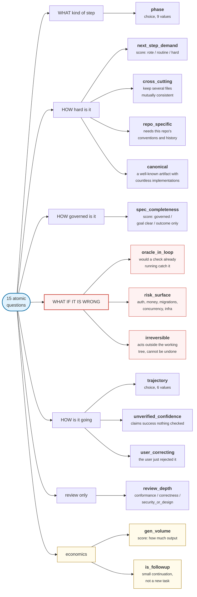

# The ontology, visualized

`jev_ontology.py` answers exactly one question: **what tier does this work want,
and why.** It knows nothing about money, nothing about the prompt cache and
nothing about HTTP. Pure functions, stdlib only, no state. The router decides
whether the answer is affordable.

## The rule that shapes everything

> Code extracts facts, Jev makes judgments. Anything computable from the request
> body is computed here and handed to Jev as structured state. **Jev is never
> asked something a regex already knows.**

This is not a style preference. Asking a model "how many files were edited" burns
latency and tokens to get a worse answer than `len()`. Asking a regex "is the
approach in question" gets you keyword bingo. The split follows the strengths.

```mermaid
flowchart LR
    body["request body<br/><small>full history, every turn</small>"]

    subgraph facts["FACTS: pure code, &lt;1ms, deterministic"]
        direction TB
        f1["<b>TOOL_KINDS</b><br/><small>29 tool names &rarr; 11 kinds</small>"]
        f2["<b>BASH_CLASSES</b><br/><small>8 classes, most<br/>consequential wins</small>"]
        f3["<b>FAIL_TEXT / PASS_TEXT</b><br/><small>did the check pass</small>"]
        f4["<b>_failure_signature</b><br/><small>sha1 of a normalized<br/>error line</small>"]
        f5["<b>RISK_SURFACE</b><br/><small>auth, money, migrations,<br/>infra, concurrency</small>"]
        f6["<b>system-reminder parse</b><br/><small>plan mode, todos,<br/>CLAUDE.md, skills</small>"]
    end

    subgraph ledger["THE LEDGER: six sections"]
        direction TB
        l1["<b>harness</b><br/><small>role, plan mode, thinking budget,<br/>LSP, MCP servers, skills</small>"]
        l2["<b>unit</b><br/><small>opening request, latest ask,<br/>human turns, steps, todos</small>"]
        l3["<b>activity</b><br/><small>tool kinds, bash classes, files<br/>edited, lines, searches, subagents</small>"]
        l4["<b>verification</b><br/><small>check runs, last check, failure<br/>streak, same failure repeats,<br/>edits since last check</small>"]
        l5["<b>risk</b><br/><small>risk surface hits, outward or<br/>destructive commands, MCP writes</small>"]
        l6["<b>recent_steps</b><br/><small>compact per-step records</small>"]
    end

    jev["<b>JUDGMENTS: Jev</b><br/><small>15 atomic questions.<br/>Never asked what a<br/>regex already knows.</small>"]
    pol["<b>pick_tier_v2</b><br/><small>weighing, in code<br/>you can read</small>"]

    body --> facts --> ledger
    ledger -->|"state document"| jev
    jev --> pol
    ledger --> pol
    pol --> out["tier, reasons,<br/>safety, sticky, effort"]

    style facts fill:#ecfdf5,stroke:#0c8a6c,stroke-width:2px
    style ledger fill:#f9fafb,stroke:#6b7280
    style jev fill:#e0f2fe,stroke:#0369a1,stroke-width:2px
    style pol fill:#fffbeb,stroke:#a87b0b,stroke-width:2px
```



The ledger is **recomputed from the request, never held in memory**. Claude Code
resends the full history on every call, so `extract_ledger(body)` is a pure
function: it survives router restarts and it cannot drift from reality. After a
`/compact` the history shrinks and so does the ledger. That is accepted.

## The nine SDLC phases

The lifecycle is the spine of the thing. These are the definitions Jev is given,
verbatim:

| Phase | Definition |
| --- | --- |
| `clarify` | Requirements are being established: the agent should ask, restate, or pin down what is wanted before doing anything |
| `explore` | Locating and reading: grep, find, file reads, symbol lookups, MCP or doc queries, to learn where things are and how they work |
| `plan` | Deciding the approach: architecture, trade-offs, a multi-step plan, decomposing work, choosing what to delegate to subagents |
| `implement` | Writing or changing code according to an approach that already exists |
| `debug` | A check has failed or behaviour is wrong, and the cause is not yet known: forming and testing hypotheses |
| `verify` | Running tests, builds, linters or type checks and reading the result, with no diagnosis needed yet |
| `review` | Judging existing code or a diff: correctness, security, design, conformance to conventions; writing review findings |
| `integrate` | Wrapping up: commits, PR descriptions, changelogs, docs, ticket updates, pushing or deploying |
| `housekeeping` | Not a step of work: a skill or tool schema loading, an attachment arriving, a session resuming, a bare acknowledgement |

Each phase starts from a base tier:


`explore`, `verify` and `integrate` start at the cheapest rung because locating
code, reading a test result and writing a commit message are cheap cognition.
`plan` starts at the top because the approach is the expensive decision and a
wrong approach costs every step that follows it. `housekeeping` spends no Jev call
at all: the session holds whatever tier it had.

There is also a **deterministic phase hint** computed from the tool stream
(`_phase_hint`), used as a fallback whenever Jev's confidence in `phase` falls
below 0.45. It is a priority cascade then a vote: plan mode wins outright, a
skill load means housekeeping, a failure streak means debug, an outward or
version-control-write bash command means integrate, looking at a diff while
editing nothing means review, and otherwise the last five steps vote.

## The 15 questions on nine axes



The red axis is the one most routers leave out. "What if it is wrong" is not a
tiebreaker, it is half the formula.

Three answer types. `choice` picks a label from a definition set. `score` is an
ordinal 0/1/2. `noul` is a single 0 to 1 likelihood.

| Question | Type | Asked when |
| --- | --- | --- |
| `phase` | choice | every decision |
| `next_step_demand` | score | every decision |
| `spec_completeness` | score | **human turns only** |
| `cross_cutting` | noul | every decision |
| `repo_specific` | noul | every decision |
| `canonical` | noul | every decision |
| `oracle_in_loop` | noul | every decision |
| `risk_surface` | noul | every decision |
| `irreversible` | noul | every decision |
| `trajectory` | choice | every decision |
| `unverified_confidence` | noul | every decision |
| `user_correcting` | noul | **human turns only** |
| `review_depth` | choice | every decision |
| `gen_volume` | score | every decision |
| `is_followup` | noul | **human turns only** |

Mid-run rechecks drop the three human-only questions, because there is no new
human message to judge. That leaves 12.

### The ordinal vocabularies, verbatim

`next_step_demand`, "how much judgment the agent's NEXT step needs":

0. Rote: the action is fully determined by what is already on the page
1. Routine: skilled but conventional work inside an understood approach
2. Hard: subtle reasoning, competing hypotheses, or the approach itself is in question

`spec_completeness`, "how much of the approach is already decided":

0. Governed: an explicit plan, todo list, spec or exact instruction covers the next step
1. Goal clear, method open
2. Outcome only: the path is left entirely to the agent

`gen_volume`, "how much text or code the next step will generate":

0. A brief reply, a tool call, or a small edit
1. A screenful of code or prose, or edits across a few files
2. Extensive generation: large new files, many files, or a long document

`trajectory`, "how the current run of work is going":

| Value | Definition |
| --- | --- |
| `progressing` | Each step builds on the last; checks are passing or failures are new ones |
| `slow_convergence` | Failures are changing and shrinking, but it is taking many rounds |
| `thrashing` | The same failure, or the same file, keeps coming back; the approach is not working |
| `drifting` | The work has wandered away from what the user asked for |
| `blocked_on_human` | The agent cannot proceed without a decision or information from the user |
| `just_started` | Too early to tell |

`review_depth` runs `not_review`, `conformance` (style, naming, checklist),
`correctness` (edge cases, error handling, tests), `security_or_design`
(vulnerabilities, concurrency hazards, architectural fit, API design).

## What the code measures instead of asking

Tool names map to kinds. This is the entire vocabulary, and it is isolated at the
top of the file precisely because it rots between Claude Code releases:

| Kind | Tools |
| --- | --- |
| `read` | Read, NotebookRead |
| `search` | Grep, Glob, LS |
| `edit` | Edit, MultiEdit, Write, NotebookEdit |
| `bash` | Bash, BashOutput, PowerShell |
| `subagent` | Agent, Task |
| `todo` | TodoWrite, TaskCreate, TaskUpdate, TaskList |
| `skill` | Skill, SlashCommand |
| `plan` | EnterPlanMode, ExitPlanMode |
| `ask` | AskUserQuestion |
| `web` | WebFetch, WebSearch |
| `meta` | ToolSearch, TaskOutput, TaskStop, KillShell |
| `mcp` | anything named `mcp__server__tool`, at runtime |
| `lsp` | matched by regex, at runtime |

Bash is where consequence lives, so bash gets its own ladder, checked in this
order with **the most consequential match winning**:

`destructive` &rarr; `outward` &rarr; `verify` &rarr; `vcs_write` &rarr; `package`
&rarr; `vcs_read` &rarr; `search` &rarr; `run`, falling through to `other`.

A command is split on `&&`, `||`, `;` and newlines, and each segment is
classified by the **head of its pipeline**, so `pytest | tail` is a verify rather
than a search.

Two measurements deserve calling out because they are what make "it is stuck" a
fact rather than a vibe:

- **`_failure_signature`** fingerprints a failure by taking the failing line,
  normalizing every number and hex address to `N` and every path to `/P`, then
  hashing it. The same error twice is now detectable. Note that a **passing**
  check resets the count: only failures since the last green run count as "the
  same failure again", because once the check goes green the thrash is over.
- **`oracle_in_loop` is capped when no check has ever run.** Jev can claim a
  check would catch the mistake, but if `check_runs == 0` the answer is clamped
  to 0.3. A check nobody has run is not an oracle.

## How the tier gets picked

`pick_tier_v2` in order. `top` is the highest tier index, `mid` the middle.

1. **Phase, with a confidence fallback.** If Jev's confidence in `phase` is below
   0.45, use the tool-derived hint instead.
2. **Hold.** `housekeeping`, or `trajectory == blocked_on_human`, returns
   `tier = None`. The session keeps what it had.
3. **Base tier by phase.** `explore`, `verify`, `integrate` at 0. `plan` at `top`.
   Everything else at `mid`.
4. **Demand adjustment, clamped to &plusmn;1 in total.** `demand > 1.4` adds one,
   `demand < 0.6` subtracts one, both gated on confidence. `cross_cutting > 0.7`
   adds one. Implementing with `spec_completeness > 1.4` adds one, because that is
   implementing without a plan. Exploring with two or more oversized search
   results and no LSP adds one, because grep noise is where cheap models drown.
5. **Repo-specific floor.** `repo_specific > 0.7` during implement, debug or
   review floors at `mid`. General knowledge will not save you in someone else's
   architecture.
6. **Error-cost floors.** These set `safety = True`, which the cache layer may
   not override:
   - `irreversible > 0.6` floors at `top` if also a risk surface, else `mid`.
   - `risk_surface > 0.6` with `oracle_in_loop < 0.4` floors at `top` when demand
     is at least routine, else `mid`.
   - The one **discount**: `oracle_in_loop > 0.7` with low risk and low demand
     drops a rung. Errors get caught, so buy the cheap model.
7. **Trajectory ratchet**, relative to whichever is higher of the wanted and
   current tier. The same failure three times, or `thrashing`, adds one and sets
   safety. `drifting` adds one. Claimed success with three or more unchecked
   edits floors at `mid`. `user_correcting > 0.65` adds one, sets safety, **and
   is sticky for the whole work unit.** When the user says you got it wrong, that
   is the highest-value signal available and it does not expire on the next turn.
8. **Review rules.** `security_or_design` goes to `top`. `conformance` at low risk
   caps at `mid`. And **the reviewer is never cheaper than the author**: the
   router tracks which model wrote the code being reviewed and floors the review
   at that tier.
9. **Human intent and caps.** Plan mode goes to `top`, because the user asking to
   plan is an explicit request for the expensive kind of thinking. A thinking
   budget of 16k or more floors at `mid`. `canonical > 0.7` caps at `top - 1`
   unless safety fired: the ten thousandth CRUD endpoint does not need the best
   model. An `explore` subagent caps at `mid`: searching is cheap cognition and
   only the final result returns to the parent.
10. **Effort**, and it only ever goes down. When things are calm (no safety, not
    plan mode, not thrashing or drifting), low demand in explore, verify,
    integrate or implement recommends `low`, and moderate demand recommends
    `medium`. Otherwise the client's setting is left alone.

### The output contract

```python
{"tier":    int | None,   # index into the router's ladder. None = hold.
 "reasons": list[str],    # "debug phase", "thrashing (same failure x3)", ...
 "safety":  bool,         # a FLOOR. The cache policy must not hold it down.
 "sticky":  bool,         # the floor holds for the whole work unit
 "effort":  None | "medium" | "low"}
```

`safety` and `sticky` are the entire interface to the cost layer. The ontology
never sees a price, so this is how it says "do not let arithmetic talk you out of
this one".

## When the router re-decides

Rechecks are **event-driven**, and the cadence is only a backstop. A
tool-results-only turn is held for free unless one of these fires:

| Trigger | Why |
| --- | --- |
| the phase shifted | explore becoming implement is a different job |
| a check failed twice consecutively | one failure is normal, two is a pattern |
| the same failure came back a third time | the approach is wrong, not the edit |
| a risk surface was touched for the first time | blast radius just changed |
| a skill loaded | new capability, likely new kind of work |
| five edits piled up with no check | nothing is catching mistakes any more |
| `ROUTER_RECHECK_EVERY` turns elapsed | fallback only, default 6 |

A recheck costs about 500 input tokens to Jev, a few thousandths of a cent. The
real cost is the roughly 100ms it adds to that turn, which is why it is gated on
something having actually happened.

## Limits, stated plainly

- **`irreversible` predicts, it cannot gate.** The router sees history. A
  `git push` or a `terraform apply` appears in the ledger only after it ran.
  Gating belongs in a `PreToolUse` hook or `permissions.deny`.
- **The pass/fail regexes are heuristics.** There is a guard for the case where a
  verify command's output matches both, but output formats vary and this will be
  wrong sometimes.
- **Role sniffing will rot.** Subagent roles are inferred from the `system` text.
  That is a guess about prose, and prose changes.
- **Tool names drift between releases.** `Task` versus `Agent`, `TodoWrite`
  versus `TaskCreate`, and current macOS and Linux builds dropping `Grep` and
  `Glob` in favour of searching through Bash. Every name-dependent table lives at
  the top of the file so it can be corrected without touching logic. Verify
  against your own traces.
- **Jev reads text and structured state, not images.** Screenshot-heavy turns are
  judged on their text and ledger alone. If that is your workflow, add a check
  for image blocks and pin those upward.
- **Every threshold above is a prior.** 0.45, 0.6, 0.7, 0.75, 1.4: none of them
  were fitted to data. They are starting guesses that seemed defensible. The
  calibration path is in [DEVELOPER.md](DEVELOPER.md): turn on tracing, join each
  decision to the outcome labels on the following decisions of the same session,
  and get `P(check passes | tier, phase, demand)` for your own repo.

## Running the ontology on its own

It is pure stdlib and needs no key, so the deterministic half is directly
testable:

```bash
python3 jev_ontology.py
```

That builds a synthetic session, a refund-rounding bug where the same test keeps
failing, and prints the extracted ledger plus the tier it picks with **no Jev
answers at all**. The tail of the real output:

```
state: 2007 chars (~501 tokens, ~$0.000021 per Jev call)
recheck: phase shift implement -> debug
policy : {'tier': 2,
          'reasons': ['phase unsure (0.00), using tool hint',
                      'debug phase',
                      'thrashing (same failure x3)'],
          'safety': True, 'sticky': False, 'effort': None}
```

Worth reading closely. Jev answered nothing, so phase confidence is 0.00 and the
tool-derived hint takes over. The facts alone, three identical failure signatures
against a file under `services/payments`, are enough to reach the top tier and set
a safety floor that the cache policy may not undercut. The whole judgment cost
about two hundredths of a cent of Jev, and in this run it did not need Jev at
all.
